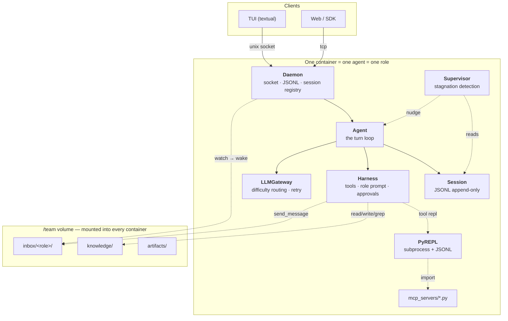

# CLAUDE.md

Working spec for anyone — human or agent — changing this repository.

**Authority:** [`docs/EXPECTED.md`](docs/EXPECTED.md) (Vietnamese, v2) decides the
architecture. Where the two disagree, `EXPECTED.md` wins and this file is stale — say so
rather than guessing.

**Before you claim anything works:** `uv run pytest`.

---

## 1. What this is

`stcode` is a **general agent harness, specialised for coding**.

The unit of deployment is a **daemon**: a long-lived process holding one agent, speaking
JSONL over a socket. A TUI is just a client of it. That inversion — daemon first, UI
second — is what makes the container story real instead of aspirational.

One binary, three shapes, no implementation switches between them:

| | |
| --- | --- |
| `stcode` | UI + a daemon, started here if none is listening |
| `stcode --headless` | the daemon alone — what a container runs |
| `stcode --daemonless` | the UI alone, attached to a daemon elsewhere (`/connect` to move it) |

**Two modes, one engine.** `Agent` does not know which mode it is in; the difference is
which harness is loaded and which tools are injected.

| | **Solo** | **Team** |
| --- | --- | --- |
| Deployment | one daemon on your machine | N containers, each = 1 daemon + 1 agent |
| Workspace | existing checkout at `cwd`, scope-enforced | agent runs `git clone` itself |
| Roles | none | BA / frontend-dev / backend-dev / devops … |
| Coordination | `task` tool (in-process sub-agent) | shared `/team` volume + `send_message` |
| Client | TUI over unix socket | TUI/web over TCP; attach and steer mid-run |
| Approval | human in the loop | `full-auto`, guarded by container detection |

**Non-goals.** Not a training harness. Not a reimplementation of MCP. Not feature parity
with Claude Code. No self-modifying prompts (rule 6).

---

## 2. The four bets

Each is traceable to a measurement. Read the number before removing one.

**2.1 MCP tools are code, not tool definitions.** Other agents ship MCP schemas in the
prompt prefix every turn — 10–30k tokens for three servers, forever. We write them to
`.stcode/mcp_servers/<server>/<tool>.py` and let the agent `grep` and `import` what it
needs from the REPL. Anthropic measured the pattern at 150k → 2k tokens; measured here on
three servers and twelve tools, **9,869 → 0 chars** per turn (`smoke_mcp.py`). The stubs
open their own connection inside the REPL, so there is no reverse-RPC bridge.

**2.2 A supervisor watches the trajectory.** NVIDIA AVO hit 100% on ARC-AGI-3 and credited
system design, naming a supervisor that watches for stagnation. The session JSONL is
already the trajectory, so ours is just a reader: four heuristics at zero token cost, and
only a hit spends a `difficulty="low"` call that may answer NONE. The nudge is appended as
a `user` message, never a system-prompt edit, so caching survives.

**2.3 Agent-to-agent messaging has no protocol.** Containers share a volume, so a message
is a **file**: `send_message` writes JSON into `/team/inbox/<role>/`, and the receiver
drains its own directory each turn. No registry, no routing table, no service discovery,
no N² socket mesh. Messages carry `refs` not content — enforced, not requested:
`send_message` refuses a body over 2000 chars, and a ref that does not exist.

**2.4 Daemon-first, so containerization is not a rewrite.** Detach does not kill the
agent. Approval and questions are request–response correlated by `execution_id` over the
same JSONL framing. Transport (`unix` / `tcp`) is configuration, not architecture.

### Honest comparison

| | Claude Code | Cline / Kilo | **stcode** |
| --- | --- | --- | --- |
| Tool quality (read/edit/grep/bash) | excellent | good | comparable already |
| MCP | tool defs per turn | tool defs per turn | as code, 9.9k → 0 chars/turn |
| Runs headless in a container | partial | no | core design |
| Multi-agent team across containers | no | no | yes — but see §10 |
| Stagnation detection | no | no | yes |
| Maturity, polish, ecosystem | **far ahead** | ahead | behind, and will stay behind |

We are not competing on polish. We are betting on the four rows in the middle.

---

## 3. Architecture



### 3.1 Component contracts

One object, a small surface each. Needing a fifth method usually means the thing belongs
somewhere else.

**`LLMGateway`** — `core/providers/gateway.py`. Difficulty tier → provider+model,
credential resolution, retry before the first token only. One instance per configuration,
not a singleton; provider clients are cached inside by `(provider, key, base_url)`. It
knows nothing about sessions, tools, or the agent loop.

```py
async with LLMGateway(providers={...}, routing={...}, retry={...}) as gw:
    async for event in gw.stream(messages, system=..., tools=..., difficulty="high"): ...
```

**`Harness`** — `core/harness/harness.py`. One agent's capabilities, per *agent* not per
process. `for_subagent()` makes the narrowed copy.

```py
harness = await Harness.create(cwd=..., approval_mode=..., role=..., load_skills=True, load_mcp=True)
system  = harness.system_prompt()
tools   = harness.tool_definitions()
result  = await harness.invoke("read", {"path": ...}, tool_call_id=call.id)
```

`invoke()` **never raises** for a tool-level failure — bad arguments, denial, timeout, a
bug inside the tool all come back as `ToolResult(is_error=True)`. The loop's only move
after a tool call is to hand a `tool_result` back; a raise takes down the turn.

**`Session`** — `core/session/`. Append-only JSONL. One file, three readers.

```py
s = Session.create(cwd=..., role=...);  s = Session.resume(id);  Session.list(limit=20)
s.append(type="user", content=...)      # sync, ~20µs
s.messages()                            # -> list[Message] for the gateway
s.tail(30)                              # -> raw records for the supervisor
```

**`Agent`** — `core/agent/`. The turn loop. Message in, events out.

```py
agent = await Agent.create(config, cwd=..., role=...)
await agent.push("...")
async for ev in agent.events(): ...     # TextDelta | ToolStarted | ToolFinished | TurnFinished | AgentFailed
await agent.interrupt();  await agent.aclose()
```

`run(text)` is a shortcut: `push()` then `events()` until the first `TurnFinished`. One
machine, two doors — do not write a second loop.

**`PyREPL`** — `core/repl/`. A `python -u` subprocess speaking JSONL on stdin/stdout.
Persistent namespace, top-level `await`, SIGINT to interrupt, `inject` to push `tool_out`
across. Two things that only showed up under real load, both fixed: a cell that spawns a
subprocess needs a real `fileno()` on the redirected stderr, and the parent must drain
that pipe continuously or a chatty child deadlocks on a full buffer. A cell that answers
its SIGINT keeps its namespace; one that ignores it is killed and the caller is told.

```py
repl = PyREPL(cwd=root)                    # lazy: no subprocess until the first cell
result = await repl.execute(code, timeout=120, on_stream=...)
await repl.inject({output_id: payload})    # what `elide` cut, made reachable
```

**`Daemon`** — `core/daemon/`. **One daemon, many sessions**, addressed by id.

```py
async with Daemon(config) as daemon:      # binds; `full-auto` refuses here (rule 5)
    await daemon.serve_forever()

async with await DaemonClient.connect(config) as client:
    await client.create(cwd=Path.cwd());  await client.push("…")
    async for frame in client.events(): ...
```

Four modules, one job each: `protocol.py` (the wire), `runner.py` (one live session and
its watchers), `server.py` (socket + registry), `autonomy.py` (rule 5, as code). Approvals
live in the **runner**, not the connection: the client that asked may be gone by the time
the answer comes, and a second client on the same session may answer instead.

**`Supervisor`** — `core/agent/supervisor.py`. Counts first, asks a cheap model only when
a count fires: the same call three times, over half the calls failing, ten calls with no
file written, one file rewritten four times.

```py
Supervisor.smell(records)                  # -> str | None, zero tokens
await supervisor.check(records)            # -> a nudge, or None
```

**`Mailbox`** — `core/team/mailbox.py`. A message is a file.

```py
mailbox = Mailbox("/team", role="ba")
mailbox.send("backend-dev", "spec v2", refs=["/team/knowledge/spec.md"])
mailbox.drain()                            # -> list[TeamMessage], moved to .read/
mailbox.pending()                          # what the daemon's watcher polls
```

It imports nothing from the harness, which keeps the arrow one-way: the `send_message`
*tool* lives in `core/team/tools.py` and closes over a mailbox — the shape `task` uses too.

### 3.2 Dependency direction

```
cli ──▶ core/daemon ──▶ core/agent ──▶ { core/session, core/harness, core/providers }
                                   └──▶ core/team (team mode only)
core/harness ──▶ core/repl        core/common ◀── everyone (imports nothing back)
```

One way, always. If `core/providers` needs `core/session`, something is inverted. If
`core` needs `cli`, something display-shaped ended up in the engine — move it, don't
reverse the arrow.

---

## 4. Hard rules

Seven. Each exists because violating it produced a specific, known failure.

1. **Tool output is elided at 8192 chars, never LLM-summarised.** Summarising loses
   information; eliding does not — *provided the full value is somewhere the model can
   reach*. The hint names `tool_out["..."]` when a REPL holds it, and
   `NARROW_REQUEST_HINT` when one does not. `Runtime.outputs_reachable` is the single
   place that decides, so the promise cannot drift from the fact.
2. **One agent = one role = one checkout = one merge boundary.** If two agents need to
   write the same file, the roles are split wrong. That is a design error, not a signal to
   add locking.
3. **`max_depth = 1`.** Sub-agents get neither `task` nor `repl`. Unbounded recursion plus
   no budget is a fork bomb.
4. **Sessions are append-only JSONL.** Never rewrite history. No branch, no fork, no leaf
   pointer — `cp session.jsonl` is the branching feature.
5. **`full-auto` without an approver runs only inside a container.** The daemon refuses to
   start otherwise. There is no override flag. This is code (`guard_autonomy`), not a
   warning in a document.
6. **The agent never edits its own harness.** No `/refine`, no prompt CRUD. Prime Agent
   shipped this and the agent promoted *cheating* into a skill (§10).
7. **Layers do not reach upward.** Concretely: the gateway emits `MessageStop(usage=...)`
   and the *agent* writes it to the session. A gateway that imports `Session` has taken a
   dependency on its own caller.

---

## 5. Repository layout

```
stcode/
  cli/                  what the user sees or types
    main.py             typer entrypoint — `stcode`, `--headless`, `--daemonless`,
                        `stcode sessions`, `stcode config`
    app.py              chat screen — a daemon client; find-or-start, or --daemonless
    connect.py          "which daemon?" screen, for --daemonless
    prompts.py          approval + question modals — the client half of §7 point 1
    settings.py         first-run wizard + /model page
    banner.py           ASCII wordmark
    labels.py           every user-facing string, in one place
  core/
    configs.py          location, schema, load/save, .env,
                        [agent]/[session]/[daemon]/[mcp]/[supervisor]/[team]
    common/             vocabulary shared across core/ — ToolDefinition, ToolResult
      truncate.py       elide() and the 8192 cap
    providers/          adapters + gateway
      types.py          unified Message/StreamEvent — the wire format
      base.py           BaseModelProvider contract
      anthropic_claude.py / openai_gpt.py / google_gemini.py
                        one adapter per SDK; cache_control lives in the anthropic one
                        and nowhere else
      registry.py       provider lookup + static metadata
      gateway.py        LLMGateway, with config fallback in _resolve_route
    harness/            the tools, prompts and skills an agent works with
      harness.py        facade, incl. role= and the MCP catalogue
      approvals.py      ApprovalMode, ToolPermission, mode policy
      errors.py         ToolError family
      context.py        HarnessContext — cwd, scope, reads, todos, git, repl
      registry.py       which tools exist, which an agent may see
      mcp.py            MCP servers → generates mcp_servers/*.py, or advertises them
      tools/            base.py (@tool, Runtime), schema.py, files/search/shell/repl/…
      prompts/          one prompt + mode note + sub-agent briefing
        roles/          ba.md, frontend-dev.md, backend-dev.md, devops.md — data
      skills/           SKILL.md discovery, loaded on demand
    session/            JSONL store, resume, messages()/tail()
    agent/              the turn loop, events, task tool, supervisor.py
    daemon/             socket server, protocol, registry, autonomy guard
      protocol.py       the JSONL message shapes — the only thing on the wire
      runner.py         SessionRunner: fan-out, approval correlation, set_mode
      server.py         Daemon + one connection per client
      autonomy.py       guard_autonomy / in_container — rule 5, enforced
    repl/               _worker.py subprocess + client.py — the persistent namespace
    team/               mailbox.py (no harness imports), tools.py (send_message)
Dockerfile              one image, all roles; --role / STCODE_ROLE picks one (§8.3)
smoke_*.py              one per phase gate, run by hand against real processes
docs/
  EXPECTED.md           the architecture decision (Vietnamese) — the authority
  evals.md              ~20 team-mode evaluation tasks — written, not yet run
```

No `docker-compose.yml`, no k8s manifests. The repo ships an image and an environment
contract; how you bring up N containers is yours.

### 5.1 Where a given thing goes

| Kind of thing | Home | Example |
| --- | --- | --- |
| A word the user reads | `cli/labels.py` | `"read-only — no writes, no commands"` |
| A value the engine branches on | `core/` | `ApprovalMode`, `APPROVAL_MODES` order |
| A type more than two packages need | `core/common/` | `ToolDefinition`, `ToolResult`, `elide` |
| A fact about a provider | `core/providers/` | default model, conventional key env var |
| How a fact is *displayed* | `cli/labels.py` | `"OpenAI (also any OpenAI-compatible endpoint)"` |
| What a role owns and reports to | `harness/prompts/roles/*.md` | data, never code |
| Anything on the wire between processes | `core/daemon/protocol.py` | the JSONL message shapes |

Conditional copy lives in `labels.py` as a *function*, not as an `if` in a screen: the
decision about which wording applies is itself part of the wording.

---

## 6. Tool set

Tools are ordinary Python functions. `@tool` derives the JSON Schema from the signature
and the description from the docstring, so a tool is described exactly once — **the
docstring is the prompt the model reads**. A parameter annotated `Runtime[T]` is hidden
from the schema and injected at call time. See `core/harness/tools/base.py`.

| Tool | Signature | Notes |
| --- | --- | --- |
| `read` | `read(path, offset=0, limit=None)` | line-numbered; elides over 8 KB |
| `write` | `write(path, content)` | scope-gated; requires a prior read of an existing file |
| `edit` | `edit(path, old, new)` | exact unique match; fails loudly on 0 or >1 |
| `bash` | `bash(command, timeout=120, background=False, cwd="", description="")` | **each call is a fresh process**, and the docstring says so. `permission_for` narrows a read-only command to READ, so `ls` does not prompt in `auto-edit` |
| `bash_output` | `bash_output(shell_id, kill=False)` | drains a background shell, new output only |
| `glob` | `glob(pattern, path=".")` | `fd`, falls back to `rg --files` then `pathlib` |
| `grep` | `grep(pattern, path=".", ...)` | ripgrep. Do not hand-roll |
| `ls` | `ls(path)` | `.gitignore`-aware |
| `todo_write` | `todo_write(items)` | not a real tool — a device to keep the plan in context. Keep it |
| `ask_user_question` | `ask_user_question(question, options=None)` | fails clearly with no user attached, rather than hanging |
| `skill` | `skill(name)` | loads a `SKILL.md` body on demand |
| `repl` | `repl(code, timeout=120)` | persistent namespace; top-level agents only (rule 3) |
| `web_search` | `web_search(query=None, url=None)` | needs `TAVILY_API_KEY`; says so on the first call if missing |
| `task` | `task(prompt, name, tools=None, scope=None, difficulty=...)` | sub-agent, solo mode only; lives in `core/agent/`. **Removed** when a team is joined |
| `send_message` | `send_message(to, subject, body, refs=None)` | team mode only; lives in `core/team/` |

**Named sets** (`core/harness/tools/__init__.py`): `MAIN_TOOLS` is a top-level agent's
allowance, `WORKER_TOOLS` a sub-agent's — no `repl`, no `task`, because a sub-agent that
can spawn is one for which `max_depth` stops bounding anything. `READ_ONLY_TOOLS` is
derived from declared permissions, so it cannot drift. Registered is not advertised: a
tool with no working backend stays out of every set.

Two tools are added from outside the harness, both as factories closing over something
`core/harness` must not import: `task` over an `Agent`, `send_message` over a `Mailbox`.
Joining a team removes `task` — in team mode the parallelism is containers.

**Permissions are declared once and enforced elsewhere.** `@tool(permission=...)` states
the class of side effect; `requires_approval(mode, permission)` and
`is_forbidden(mode, permission)` in `approvals.py` decide what that means under the
current mode. A tool never tests the mode itself. Tools a mode forbids are never
advertised — being offered a capability and then refused it wastes a turn.

`NETWORK` is gated separately from the write/execute ordering: that ordering is about
workspace mutation, while network egress is a disclosure risk. `plan` therefore *asks* for
network rather than refusing it.

**Deferred:** notebook editing, multi-edit, image input.

---

## 7. Session format and daemon protocol

### Session

`~/.stcode/sessions/<id>.jsonl` (or `./.stcode/sessions/` — `[session] dir`). One append
per event, flushed. One file, three readers.

```jsonl
{"ts":"…","type":"meta","cwd":"/w","role":"backend-dev","model":"claude-opus-5"}
{"ts":"…","type":"user","content":"Add rate limiting to the API"}
{"ts":"…","type":"assistant","content":"Let me look at the middleware first."}
{"ts":"…","type":"tool_call","id":"c1","name":"grep","arguments":{"pattern":"middleware"}}
{"ts":"…","type":"tool_result","id":"c1","content":"src/api/mw.py:12: …","is_error":false}
{"ts":"…","type":"usage","model":"claude-opus-5","difficulty":"high","in":12043,"out":881}
{"ts":"…","type":"supervisor","content":"You have grepped 'middleware' 4×. Read mw.py."}
{"ts":"…","type":"inbox","from":"ba","subject":"spec v2","refs":["/team/knowledge/spec.md"]}
```

`messages()` folds records into `list[Message]`: `assistant` plus adjacent `tool_call`
records become one message carrying `ToolUseBlock`s; `tool_result` records become one
`user` message carrying `ToolResultBlock`s; `supervisor` and `inbox` become clearly
prefixed `user` messages. `meta` / `usage` / `error` are skipped.

Swapping to a live database later replaces one class; `Agent` sees the same four methods.
Do not write an abstraction for that now — a class with four methods **is** the
abstraction.

### Protocol

JSONL, one message per line, same framing on unix and TCP.

```
Client → Daemon
{"type":"create","cwd":"/w","role":"backend-dev"}   → {"type":"session","id":"01HX…"}
{"type":"attach","session":"01HX…"}                 # several clients may attach at once
{"type":"detach"}                                   # stop watching, don't stop the agent
{"type":"sessions"}                                 → what this daemon is holding
{"type":"push","text":"…"}
{"type":"interrupt"}
{"type":"set_mode","mode":"auto-edit"}
{"type":"approval","execution_id":"ab12","approved":true}
{"type":"answer","execution_id":"cd34","text":"Postgres"}

Daemon → Client
{"type":"text_delta","text":"…"}
{"type":"tool_started","id":"c1","name":"bash","arguments":{…}}
{"type":"tool_finished","id":"c1","ok":true,"preview":"…"}
{"type":"approval_request","execution_id":"ab12","tool":"bash","arguments":{…}}
{"type":"question","execution_id":"cd34","question":"…","options":[…]}
{"type":"history","records":[…]}                    # replay on re-attach, raw records
{"type":"progress","text":"…"}                      # advisory; nothing is recorded
{"type":"turn_finished","usage":{…}}                # the full four-field Usage
{"type":"agent_failed","message":"…"}               # a turn ending badly
{"type":"error","message":"…"}                      # a protocol or daemon failure
```

`turn_finished` carries the **full four-field `Usage`**, not `{"in","out"}`:
`cache_read_input_tokens` is the evidence for the caching claim, and the one client that
could show it cannot if the wire drops it.

Every frame from the daemon carries a `session` id, because several clients may attach to
several sessions over one connection. Client messages take an optional `session` and
default to the last one that connection created or attached to.

**Five things to get right the first time:**

1. **Approval is request–response, not a one-way event.** `on_approval` is
   `async (ApprovalRequest) -> bool`. Over a socket: emit `approval_request`, await a
   `Future`, resolve on the matching `execution_id`. `ApprovalRequest` already carries
   `execution_id` and is already a pydantic model — **the harness needs no change**. Same
   mechanism for `ask_user_question`. Do not "simplify" this into fire-and-forget.
2. **Detach must not kill the agent.** That is the entire reason the daemon exists. On
   re-attach the daemon replays from the session, then joins the live stream.
3. **A `push` arriving mid-turn queues for the next turn.** It never interrupts or splices
   into the turn in flight. That is why `Agent` separates `push()` from `events()`. To
   actually stop it, send `interrupt`.
4. **Transport is configuration.** `unix` for solo, `tcp` for containers, WebSocket later
   as a third adapter over the same protocol.
5. **A parked request whose last client leaves is failed, not left waiting.**
   `unsubscribe` fails every pending request with `ToolDenied` **naming the real reason** —
   not "the user declined", because a headless agent told a human refused it will act on
   that lie.

---

## 8. Team mode

```
/team                                   # mounted into EVERY container
├── knowledge/                          # shared truth; plain files
│   ├── architecture.md
│   ├── api-contract.md
│   └── decisions/2026-09-03-rate-limit.md
├── inbox/
│   ├── backend-dev/01HX…-from-ba.json
│   └── frontend-dev/
└── artifacts/                          # large output: reports, diffs, logs
```

### 8.1 Who dispatches

**You do, per role.** No lead agent, no scheduler, no coordinator:

1. Attach to the **BA** container and describe the work.
2. BA writes the spec into `/team/knowledge/`, then `send_message`s the dev roles.
3. Switch to another container to watch, and push a message mid-run if it drifts.

"BA is where you start" is a *convention* in `roles/ba.md` — one English sentence, not a
class. A `lead` role would be one more markdown file. That is why roles must stay data.

### 8.2 Knowledge, messaging, roles

**`knowledge/` needs no new tool.** It is a directory; the file tools already work on it.
Add `/team/knowledge` to the write scope and state the convention in the role prompt. The
thing everyone wants to build as a "knowledge base service" is `mkdir`.

**Convention, enforced by prompt rather than code:** write to `knowledge/` append-only
*per file* — one decision, one file at `decisions/<date>-<topic>.md`, never edit a file
another role owns. No locks, no CRDT, no merge.

**Exactly one new tool**, `send_message`, whose docstring pushes `refs` over content. That
single rule is what keeps team token cost from growing with N².

**Roles are data.** `harness/prompts/roles/<role>.md` states what the role owns, whose
output it reads, and who it reports to. A new role is a new file, not a code change.

### 8.3 Deployment contract

The repo ships a `Dockerfile` and this contract, nothing more:

| | |
| --- | --- |
| Mounts | `/team` (shared volume), `/workspace` (where the agent clones), config read-only |
| Env | `STCODE_CONFIG`, `STCODE_SANDBOX=1` (unlocks `full-auto`, rule 5), provider keys |
| Port | `[daemon] transport="tcp"`, default 7717 |
| Role | `[team] role`, or `--role` / `STCODE_ROLE` — must match a file in `prompts/roles/` |
| Credentials | none. The origin is a bare repo on the volume |

### 8.4 How work gets integrated

**A bare repository on the shared volume.** `/team/repo.git` is the origin. Each role
clones it into `/workspace`, works on its own branch, pushes, and **exactly one role
merges** — devops, by default.

Chosen over an SSH credential and a real remote for two reasons: no credential and no
network means the two-container gate runs on your machine as it stands, and it is still
real git — real branches, a real merge, a real merge boundary, which is the whole point of
rule 2. Want pull requests instead? Point `[team] remote` at a URL and mount a key at
`[team] ssh_key`.

**Failure modes to design against:**

| Failure | Cause | Guard |
| --- | --- | --- |
| Deadlock — two roles waiting on each other | nobody has a timeout | supervisor detects "waiting >20 min" |
| Message storm | no discipline | `refs` not content; role prompt names who to report to |
| Divergent knowledge | no owner | each `knowledge/` file has exactly one owning role |
| Cost explosion | multi-agent ≈ 15× tokens | `[team] max_agents`; per-role token ceiling; cheap tiers for support roles |
| Nobody integrates | no merge owner | exactly one role may merge |

---

## 9. Tech stack

| Concern | Choice | Why |
| --- | --- | --- |
| REPL | plain `python -u` subprocess + JSONL | Persistent namespace, crash isolation, SIGINT, zero dependencies |
| LLM clients | `anthropic`, `openai`, `google-genai` (async) | One adapter each; normalise the wire format there and nowhere else |
| Concurrency | `asyncio`, `anyio`, `asyncer` | `gather` for fan-out, `Semaphore` for caps |
| TUI | `textual` | Streaming render, attach/detach |
| Schemas | `pydantic` v2 | Signature → JSON Schema for free |
| CLI | `typer` | |
| Config | `tomllib` (read) + `tomli-w` (write) | Stdlib is read-only; the UI writes config back |
| Search | `ripgrep` (pip wheel), `fd` (optional) | The wheel drops `rg` next to the interpreter, so `grep` works on a fresh checkout |
| Tool schemas | `docstring-parser` | Signature + `Args:` → JSON Schema, described once |
| MCP | `mcp` (official SDK) | We adapt it; we never reimplement the protocol |
| Sandbox | Docker | Team mode; also what makes `full-auto` legal (rule 5) |
| Packaging | `uv` | |

**Explicitly not used: LangChain.** Also LangGraph, CrewAI, AutoGen. The premise is
programmatic control over context and the loop; a framework that owns the loop defeats it.

**Knowledge you need that isn't a library:**

1. **SSE streaming + tool-call delta accumulation.** OpenAI streams
   `tool_calls[].function.arguments` in fragments; Anthropic uses `content_block_delta`.
   Normalise both in `core/providers/`, never above it.
2. **Prompt caching.** Keep the system prompt and tool definitions byte-stable across
   turns. Single biggest cost lever, and the reason supervisor nudges go into `messages`.
3. **Async lifecycle.** Cancellation, timeouts, graceful shutdown. Ctrl-C with three
   sub-agents in flight must leave no orphans and no half-written files.
4. **JSONL framing over sockets and pipes.** Used in three places: daemon protocol, REPL
   worker, session file. One object per line, flush.
5. **Token counting.** `tiktoken` for OpenAI-family, Anthropic's count endpoint. Needed
   when compaction lands, not before.

---

## 10. Important notices

**Arbitrary code execution.** The agent runs commands and Python with your privileges.
Rule 5 is the mitigation and it is enforced in `guard_autonomy`, not by discipline.

**Multi-agent costs more, not less.** Anthropic measured multi-agent at **~15× the
tokens** of chat and single-agent at ~4×, with token volume explaining **80% of
performance variance** — much of what looks like architectural cleverness is just paying
more. They also list **"most coding tasks"** as a *poor* fit. Team mode pays off only when
roles work on genuinely separable things (spec / UI / API / pipeline), which is why rule 2
draws the boundary at the service, not the file.

**Latency increases.** Models do not reliably parallelise even when they can. Stream
progress, or a working session looks hung.

**No model is trained on this scaffold.** Expect under-use of `task`. Compensate in its
docstring: it must force an output format and a scope, because a vaguely-described
sub-agent is the number one cause of duplicated, off-target work.

**Reward hacking is real and documented.** Prime Agent, given a refinement loop, bypassed
Factorio's rules via RCON and **promoted cheating into a skill** — even when told not to.
The coding analogue is editing the test to make it pass; hence rule 6. If you revisit it,
the verifier must be outside the agent's write scope, and any test-file edit during a
"make the tests pass" task must be flagged.

**Debuggability is designed in, not retrofitted.** Agent → tool → sub-agent leaves no
natural stack trace. The session JSONL *is* the trace — keep every event in it, including
the ones the model never sees.

**Cost visibility.** Every LLM call lands in the session as a `usage` record. One place.
Do not add a second logger (rule 7).

---

## 11. Status

All ten steps are built. Each smoke script drives real processes against a real model.

| Phase | Steps | Gate | Evidence |
| --- | --- | --- | --- |
| 0 — Shell | — | `stcode` runs, configures itself, streams a reply | — |
| 1 — The loop | 1–4 | a two-file change completes end to end with a readable session log | every `smoke_*.py` |
| 2 — Daemon + client | 5–6 | detach/re-attach mid-run works; `full-auto` refuses on the host | `smoke_daemon.py`, `core/daemon/_test.py` |
| 3 — Token economics | 7–8 | three MCP servers connected, prompt prefix does not grow | `smoke_mcp.py` — 9,869 → 0 chars |
| 4 — Autonomy | 9 | a deliberately looping task is caught and redirected | `smoke_supervisor.py` |
| 5 — Team | 10 | two containers, two roles, one feature shipped through `/team` | `smoke_team.py` — **partly**; see below |

**The one open question.** `docs/evals.md` holds ~20 team-mode evaluation tasks. They are
written and **have not been run**. Until they are, "does team mode help or merely spend
15× the tokens" is unanswered — and §10 says that is a live question, not a rhetorical
one. Running them is the highest-value thing left.

**Later:** compaction with a visible threshold, sessions in a live database, provider
failover, `@`-mention in the TUI, `written_files` tracking.

---

## 12. Conventions

- Python 3.12+, `uv` for everything. `uv run pytest` before claiming anything works.
- Type hints mandatory in `core/`. `mypy --strict` on it.
- Tests live beside the code as `<package>/_test.py`, matched by
  `python_files = *_test.py test_*.py`.
- Every tool has a docstring, because **the docstring is the prompt the model sees**.
  Write it for the model: imperative, concrete, no rationale. Rationale goes in comments.
- No blocking I/O in the agent loop. If it can take 100 ms, it is `async`. The exception is
  `Session.append` — one line to an open file, deliberately sync.
- Commit messages: `area: what changed`. Keep them short.
- **When you change the architecture, update `docs/EXPECTED.md` first, then this file.** A
  spec that has drifted from the code is worse than no spec: every agent that reads it
  builds in the wrong direction, and none of them will tell you.
