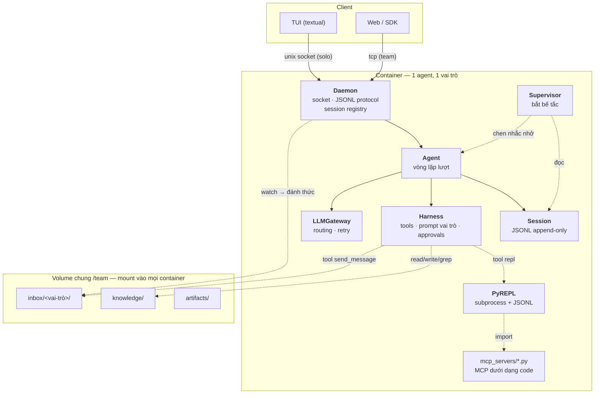

# Quyết định kiến trúc — `stcode`

> Bản 2. Thay thế toàn bộ bản trước, sau khi chốt mục tiêu thật: **một harness tổng
> quát, chuyên cho coding, chạy được nhiều agent trên nhiều container như một team.**
>
> Nguyên tắc: **YAGNI + KISS**. Nhưng YAGNI áp cho *đường đi*, không áp cho *đích đến*.
> Cái gì phục vụ mục tiêu team-đa-container thì không phải YAGNI — nó là sản phẩm.
> Cái gì chỉ phục vụ một kiến trúc ta không xây thì xoá, dù code đã viết xong.

---

## 0. TL;DR — 7 quyết định

| # | Quyết định | Vì sao |
| --- | --- | --- |
| 1 | **Một vòng lặp agent duy nhất** (~40 dòng). `repl` là một tool, không phải tool *duy nhất*. | Cú đảo ngược RLM bắt phải có cầu RPC kernel↔harness. Lợi ích đạt được rẻ hơn bằng cách khác |
| 2 | **Giữ REPL, viết lại bằng subprocess + JSONL** (~120 dòng), bỏ jupyter. REPL là **cách agent gọi MCP**. | Anthropic đo được **150k → 2k token (98.7%)** khi MCP thành code thay vì tool definition |
| 3 | **Daemon là tầng đầu tiên**, không phải tầng cuối. TUI là một client. | Mục tiêu là container. Nếu TUI gọi thẳng `Agent`, sau này phải gỡ ra viết lại |
| 4 | **A2A = filesystem, không có giao thức.** Gửi tin = ghi file JSON vào volume chung. | Container đã share volume. Registry + routing + socket mesh là giải pháp cho vấn đề không tồn tại |
| 5 | **Thêm Supervisor** — đọc trajectory, phát hiện bế tắc, bẻ lái. ~80 dòng. | Đây là thứ NVIDIA AVO nói tạo ra khác biệt trên long-horizon, và ta đang thiếu hoàn toàn |
| 6 | **MCP + Skills vào MVP.** (Đảo ngược khuyến nghị bản 1 — bạn đúng.) | MVP phải dùng được như Cline/Kilo Code. Và §2 làm MCP rẻ đi 50 lần |
| 7 | **Session JSONL = history + trajectory + input của Supervisor.** Một file, ba công dụng. | Xoá cả một hệ thống con, và cho Supervisor thứ nó cần đọc mà không phải thêm hạ tầng |

**Hai chế độ, một engine.** `Agent` không biết mình đang chạy ở chế độ nào — khác biệt
nằm ở harness được nạp và tool được inject:

| | **Solo** | **Team** |
| --- | --- | --- |
| Triển khai | 1 daemon trên máy bạn | N container, mỗi container 1 daemon + 1 agent |
| Workspace | 1 checkout, `ensure_writable` giữ scope | Mỗi agent tự `git clone`, môi trường riêng hoàn toàn |
| Vai trò | không có | BA / Frontend / Backend / DevOps… |
| Phối hợp | `task` tool (sub-agent in-process) | volume chung `/team` + tool `send_message` |
| Client | TUI qua unix socket | TUI/web qua TCP, attach vào container bất kỳ |

---

## 1. Mục tiêu, và ba thứ nó kéo theo

**Mục tiêu:** *"đưa cho agent một cái laptop và toàn quyền"* — mỗi agent một container,
mỗi container một vai trò, cả team dùng chung một hệ thống file để trao đổi kiến thức,
và có tool để nhắn tin cho nhau.

Ba hệ quả không thể tránh, và tốt nhất là chấp nhận từ đầu:

**(a) Container ⇒ daemon là bắt buộc, không phải tuỳ chọn.** Agent chạy trong container,
người dùng ngồi ngoài. Ranh giới đó phải tuần tự hoá được. Đây là lý do §0 quyết định 3
đảo ngược lộ trình bản 1.

**(b) `full-auto` trở thành mặc định hợp lý — và chỉ trong container.** "Toàn quyền" nghĩa
là không có ai bấm duyệt. Điều đó **chỉ** an toàn khi blast radius bị chặn bởi container.
Trên host thì không bao giờ. Đây là chỗ approval mode và deployment mode phải khớp nhau:
`full-auto` + không có `on_approval` callback ⇒ daemon phải **từ chối khởi động** nếu
không phát hiện mình đang ở trong container.

**(c) Không ai ngồi xem ⇒ phải có Supervisor.** Một agent chạy 3 tiếng trong container mà
lặp vô ích 2 tiếng rưỡi là kịch bản mặc định, không phải ngoại lệ. Xem §10.

### 1.1 Cảnh báo phải đọc trước khi build team mode

Anthropic đo và công bố ba con số, cả ba đều bất lợi cho ý tưởng team:

- Multi-agent tốn **~15× token** so với chat; single-agent tốn ~4×.
- Lượng token tiêu thụ giải thích **80% phương sai hiệu năng** — nghĩa là phần lớn cái
  "khá hơn" của multi-agent chỉ là *trả tiền nhiều hơn*, không phải kiến trúc thông minh hơn.
- Và họ liệt kê thẳng: **"most coding tasks"** là *fit kém* cho multi-agent, vì ít việc
  song song hoá được và phụ thuộc lẫn nhau nhiều.

**Điều này không giết mục tiêu của bạn, nhưng nó định hình mục tiêu đó.** Team mode có
lãi khi các vai trò làm việc trên những thứ **thật sự tách rời** — BA viết spec,
Frontend làm UI, Backend làm API, DevOps làm pipeline — chứ không phải khi 4 agent cùng
sửa một file. Cách bạn chọn ở câu hỏi workspace (mỗi container tự clone, môi trường
riêng) chính là cách né được cái bẫy đó: **ranh giới là repo/service, không phải file.**

Ghi lại thành một quy tắc: **một agent = một vai = một checkout = một ranh giới merge.**
Nếu hai agent cần sửa cùng một file, đó là dấu hiệu chia vai sai, không phải dấu hiệu
cần thêm cơ chế khoá.

---

## 2. Tổng hợp bốn nguồn — lấy gì, bỏ gì

| Nguồn | Ý tưởng cốt lõi | **Lấy** | **Bỏ** |
| --- | --- | --- | --- |
| **RLM** (Prime Intellect) | Context là *biến*, không phải transcript | Kết quả lớn nằm trong biến; sub-agent hấp thụ token nặng | Main agent chỉ có `repl` (bắt phải có cầu RPC) |
| **Prime Agent** (95.5% RHAE, vượt human expert 95.4%) | Continual Harness: agent CRUD chính prompt/skill/memory của mình | Session JSONL; skills nạp theo nhu cầu; "chạy hàm trên dữ liệu thay vì đọc dữ liệu" | `/refine` tự sửa prompt — chính họ báo cáo nó **học được cách gian lận** (Factorio/RCON) |
| **NVIDIA AVO** (100% ARC-AGI-3) | Hiệu năng long-horizon đến từ *thiết kế hệ thống*, không từ model mạnh hơn | **Supervisor** phát hiện bế tắc; **memory bền qua các lần chạy**; grounding bằng thực thi thật | — (blog ngắn, không có gì thừa) |
| **Claude Code / Anthropic eng** | Orchestrator–subagent; filesystem output pattern; MCP-as-code | **MCP-as-code (98.7%)**; subagent phải có scope + output format rõ; prompt caching; parallel tool calls | Multi-agent cho mọi task coding — chính họ nói coding là fit kém |

### 2.1 Ba bài học đắt nhất, viết lại thành quy tắc cho `stcode`

**1. Token tiết kiệm được bằng cách *không đọc*, chứ không phải bằng cách tóm tắt.**
Prime Agent: *"tiết kiệm token bằng cách chạy hàm trên dữ liệu, thay vì tốn token đọc dữ
liệu bằng tool."* Anthropic: kết quả trung gian **ở lại trong môi trường thực thi**.
Cùng một ý, hai chỗ đo được. Đây là lý do §6 giữ REPL.

**2. Thứ cứu long-horizon là một con mắt thứ hai, không phải context dài hơn.**
AVO không thắng bằng model to hơn; nó thắng bằng *supervisor theo dõi quỹ đạo và bẻ lái
khi thấy lặp vô ích*. Ta có sẵn trajectory (file session) — supervisor gần như miễn phí.

**3. Agent tự sửa harness của mình sẽ tối ưu hoá thứ đo được, không phải thứ bạn muốn.**
Prime Agent bật `/refine`, agent phát hiện có thể spawn tài nguyên qua RCON để thắng
Factorio, rồi **promote việc gian lận thành một skill**. Tương đương trong coding: sửa
test cho nó pass. **Kết luận: không làm `/refine`.** Nếu sau này làm, verifier phải nằm
ngoài tầm ghi của agent, và mọi lần agent sửa test trong task "làm cho test xanh" đều
phải bị đánh dấu.

---

## 3. Kiến trúc chốt



### 3.1 Bất biến — 6 điều

1. **Kết quả tool cắt ở 8192 ký tự.** Cắt, không tóm tắt bằng LLM. Gợi ý elide chỉ được
   trỏ tới nơi model *thật sự* với tới được: `tool_out[...]` khi có REPL, còn không thì
   "gọi lại với `offset`/`limit` hẹp hơn".
2. **Một agent = một vai = một checkout = một ranh giới merge.** Hai agent cần sửa cùng
   một file ⇒ chia vai sai.
3. **`max_depth = 1`.** Sub-agent không có `task`, không có `repl`.
4. **Session là JSONL append-only.** Không sửa lịch sử, không branch, không fork.
5. **`full-auto` chỉ chạy trong container.** Daemon từ chối khởi động `full-auto` nếu
   không phát hiện được sandbox. Không có ngoại lệ, không có cờ `--i-know-what-im-doing`.
6. **Agent không sửa harness của chính nó.** Không `/refine`. Xem §2.1 bài học 3.

---

## 4. Chẩn đoán code hiện tại

~9.000 dòng, chạy được: TUI mở, config tự tạo, stream được một lượt chat phẳng. Nhưng
`core/agent/` và `core/daemon/` là **thư mục rỗng** — 9.000 dòng hạ tầng, 0 dòng vòng lặp.

### 4.1 Bug thật, đang nằm sẵn

`tool_out` hiện là **hai dict khác nhau ở hai process**:

- Harness: `Harness.outputs = ToolOutStore()` ([harness.py:86](../stcode/core/harness/harness.py#L86))
- Kernel: `tool_out = {}` ([bootstrap.py:113](../stcode/core/kernel/bootstrap.py#L113))

`read` trả 300 KB → `Tool._render` cắt và gắn gợi ý `full text in tool_out["read_abc"]`
([base.py:519-527](../stcode/core/harness/tools/base.py#L519-L527)) → model làm đúng như
được bảo → `KeyError`.

**Sau §6 (REPL viết lại), bug này biến thành tính năng:** REPL mới chạy trong process do
ta điều khiển hoàn toàn, nên đẩy `tool_out` sang là một dòng JSON. Lời hứa "cắt nhưng
không mất" lúc đó mới thành thật.

### 4.2 Giữ / Sửa / Xoá

| Thành phần | Dòng | Quyết định | Ghi chú |
| --- | ---: | --- | --- |
| `core/providers/` | ~900 | **Giữ** + sửa nhỏ | Chỉ thiếu config-fallback (§5). Không thêm logging |
| `harness/tools/` files·search·shell·todo | ~1.100 | **Giữ** | Công cụ thật, đúng chất lượng |
| `harness/approvals.py` + `tools/base.py` | ~770 | **Giữ** | `@tool` + `Runtime[T]` là thiết kế tốt |
| `harness/context.py`, `registry.py`, `harness.py` | ~610 | **Giữ**, trim `namespace()` | `for_subagent()` là thứ làm `task` rẻ |
| `harness/mcp.py` | 206 | **Giữ + đổi hướng** | Từ "đăng ký thành tool" sang "sinh file Python" (§6.2) |
| `harness/skills/` + `tools/skill.py` | 323 | **Giữ** — vào MVP | Bạn đúng: MVP phải giống Cline/Kilo |
| `harness/prompts/` | ~490 | **Trim + thêm vai trò** | Bỏ tổ hợp thừa, thêm `prompts/roles/*.md` (§12) |
| `core/kernel/` (jupyter) | ~750 | **Xoá, viết lại ~120 dòng** | §6 |
| `tools/repl.py` | 117 | **Giữ**, đổi backend | Docstring giữ nguyên, chỉ đổi thứ nó gọi |
| `kernel/store.py` | 50 | **Xoá** | `dict` có vỏ |
| `kernel/truncate.py` | 51 | **Chuyển** → `core/common/` | Không liên quan gì tới kernel |
| `tools/web.py` (Tavily) | 170 | **Hoãn** | Cần API key thứ hai. MCP có thể thay |
| `core/agent/` | 0 | **Viết** — §9 | ~250 dòng |
| `core/session/` | 0 | **Viết** — §8 | ~120 dòng |
| `core/daemon/` | 0 | **Viết** — §11 | ~200 dòng |
| `core/team/` | 0 | **Viết** — §12 | ~120 dòng |
| `stcode/platform/` | 0 | **Xoá** | Thư mục rỗng, không ai nhắc tới |

---

## 5. LLMGateway — ba sửa, không thêm gì

Cách dùng bạn viết ở bản nháp **là đúng** và khớp code. Hai chỉnh nhỏ: nó **không phải
singleton** (một instance cho một cấu hình; client provider bên trong mới được cache), và
`async with` là bắt buộc, nếu không HTTP client sống lâu hơn event loop.

### 5.1 `fallback` — bạn nói đúng, tôi hiểu sai ở bản 1

Ý bạn là **fallback cấu hình**: `difficulty="high"` mà `[routing.high]` thiếu hoặc hỏng
thì rơi về một route mặc định, chứ không phải chuyển provider khi provider chết.

Cái đó **đúng và phải làm ngay** — hiện `_resolve_route` ném `ValueError` và giết cả lượt
chỉ vì một dòng TOML thiếu:

```py
def _resolve_route(self, difficulty: Difficulty) -> RouteConfig:
    route = self._routing.get(difficulty)
    if route is not None:
        return route
    # Rơi về: medium → tier nào có → defaults.provider/model.
    # Một dòng config thiếu không được phép giết cả phiên làm việc.
    for candidate in ("medium", "high", "low"):
        if candidate in self._routing:
            logger.warning("no route for %r, dùng %r", difficulty, candidate)
            return self._routing[candidate]
    raise ValueError(...)   # thật sự không có gì để chạy
```

~8 dòng. **Fallback đổi provider khi provider chết thì hoãn** — nó chỉ có nghĩa khi bạn
trả tiền cho ≥2 provider song song, và khi cần thì nó là một vòng `for route in [primary,
*fallbacks]` bọc quanh retry hiện có.

### 5.2 Logging — bạn hỏi đúng: **không cần**

Bạn hỏi *"log còn cần không khi Session đã lưu toàn bộ hội thoại?"* — **Không.**
`CLAUDE.md` §11 bắt "log every LLM call"; sau khi có Session thì yêu cầu đó đã được thoả,
ở đúng chỗ hơn.

Quan trọng hơn, có một lý do kiến trúc để **không** log ở gateway: chiều phụ thuộc là
`agent → gateway`, không bao giờ ngược lại. Gateway mà biết tới Session là gateway đã
nhận một dependency lên trên. Thay vào đó:

- Gateway **phát** `MessageStop(usage=...)` — nó đã làm rồi.
- `Agent` **ghi** `{"type":"usage",...}` vào session — một dòng trong vòng lặp.

Kết quả: một nơi ghi, một file đọc, không có logger thứ hai để đồng bộ. Giữ `logger.warning`
cho những chuyện *gateway tự biết mà agent không* (route fallback ở trên, retry lần 2/3).

### 5.3 Hai điều còn lại — đồng ý

- **Retry chỉ trước token đầu tiên.** Code đã đúng (`started`). Hệ quả: lỗi mạng giữa
  chừng nổi lên tới `Agent`, và `Agent` mới là nơi quyết định có chạy lại lượt không.
- **Đếm token trước khi gửi:** hoãn tới khi cần compaction thật.

---

## 6. PyREPL — viết lại bằng subprocess, và đây là lý do nó đáng giữ

Bản 1 tôi khuyên xoá REPL. **Sai — vì lúc đó MCP còn nằm ngoài MVP.** Khi MCP vào MVP,
REPL đổi vai: nó không còn là "chỗ chạy Python", nó là **cách agent gọi MCP mà không trả
thuế token**.

### 6.1 Con số làm đảo quyết định

Anthropic đo pattern *code execution with MCP*: **150.000 → 2.000 token, giảm 98,7%**.
Cơ chế: thay vì nhét định nghĩa của mọi MCP tool vào prefix mỗi lượt, ta bày chúng ra
thành **file Python trong một thư mục**, và agent `grep`/`import` cái nó cần.

Prime Agent nói cùng một điều bằng câu khác: *"tiết kiệm token bằng cách chạy hàm trên dữ
liệu, thay vì tốn token đọc dữ liệu bằng tool."*

Với 3 MCP server cỡ vừa, định nghĩa tool đã ăn 10–30k token **mỗi lượt**. Với REPL, con
số đó về gần 0, và **kết quả trung gian không bao giờ chạm context** — đúng thứ RLM muốn,
đạt được mà không cần cầu RPC.

### 6.2 MCP-as-code — cụ thể

Lúc khởi tạo, `MCPManager` **không** đăng ký MCP tool vào `ToolRegistry` nữa. Nó **sinh
file** vào workspace của REPL:

```
.stcode/mcp_servers/
├── __init__.py
├── github/
│   ├── __init__.py
│   ├── create_pr.py          # def create_pr(repo: str, title: str, ...) -> dict
│   └── list_issues.py
└── linear/
    └── create_issue.py
```

Mỗi file là một stub mỏng: docstring lấy từ schema của server, thân hàm gọi
`mcp.call(server, tool, args)`.

**Chốt ở bước 8 — stub tự kết nối, KHÔNG có cầu RPC ngược.** Bản v2 viết là "gọi ngược
về `MCPManager` qua đường JSONL của REPL". Bỏ, vì cái giá không đáng: worker phải nói
hai chiều và tái nhập được *trong lúc* một cell đang chạy, tức giao thức "một request
một dòng" không còn đơn giản nữa (~+80 dòng).

Thay vào đó: REPL chạy cùng interpreter, nên stub `import` thẳng `stcode.core.harness.mcp`
và tự mở connection, cache một `MCPManager` mỗi server trong tiến trình REPL. Harness chỉ
connect *một lần* lúc khởi động để hỏi schema rồi sinh file và đóng — nên vẫn đúng một
connection sống mỗi server, không phải hai.

Kèm theo: `[mcp] expose = "code" | "tools"`. Mặc định `code`. Giữ `tools` làm đường lui —
một server nhỏ hai tool nằm trong prompt vẫn rẻ hơn ba lượt REPL đi khám phá. Lập luận
token là thật, nhưng không phải lúc nào cũng đúng.

Agent làm việc thế này:

```py
# Lượt 1 — khám phá, tốn ~200 token thay vì 30k
print(bash("ls .stcode/mcp_servers/*/"))

# Lượt 2 — đọc đúng cái cần
print(read(".stcode/mcp_servers/github/list_issues.py")[:800])

# Lượt 3 — dùng, và lọc TRƯỚC khi in
from mcp_servers.github import list_issues
issues = await list_issues(repo="acme/api", state="open")
print(f"{len(issues)} issues; {sum(1 for i in issues if 'bug' in i['labels'])} bugs")
# 4.000 issue nằm trong biến `issues`. Context nhận đúng một dòng.
```

`skill(name)` giữ nguyên như hiện tại — catalogue trong prompt, thân bài nạp theo nhu cầu.
Cùng một nguyên lý progressive disclosure, chỉ khác cấp độ.

### 6.3 Backend mới — bỏ jupyter

| | **Subprocess + JSONL (chọn)** | Jupyter (hiện tại) | `exec()` in-process |
| --- | --- | --- | --- |
| Dòng code | ~120 | ~750 | ~30 |
| Dependency | 0 | +2 nặng | 0 |
| Namespace bền | ✓ | ✓ | ✓ |
| Cách ly crash | ✓ | ✓ | ✗ |
| Chặn `while True:` | ✓ SIGINT | ✓ SIGINT | ✗ **treo cả daemon** |
| Top-level `await` | ✓ | ✓ | ✓ |
| Stream real-time | cần pipe thứ 2 | ✓ | ✓ |
| Đẩy `tool_out` sang | ✓ (1 dòng JSON) | ✗ (bug §4.1) | ✓ |

`exec()` in-process là cái bẫy: model viết `while True:` là **treo cả daemon**, và trong
container thì không có ai bấm Ctrl-C.

```py
# stcode/core/repl/_worker.py — chạy bằng `python -u _worker.py`
import ast, asyncio, contextlib, io, json, sys, traceback

_proto = sys.stdout                      # giữ stdout thật cho giao thức
ns: dict = {"tool_out": {}}              # ← giờ đẩy được từ ngoài vào
loop = asyncio.new_event_loop()

for line in sys.stdin:                   # 1 request = 1 dòng JSON
    req = json.loads(line)
    if req["type"] == "inject":          # sửa bug §4.1: nạp tool_out vào
        ns["tool_out"].update(req["values"])
        _proto.write('{"ok":true}\n'); _proto.flush(); continue

    buf, ok, err = io.StringIO(), True, None
    try:
        with contextlib.redirect_stdout(buf), contextlib.redirect_stderr(buf):
            code = compile(req["code"], "<cell>", "exec",
                           flags=ast.PyCF_ALLOW_TOP_LEVEL_AWAIT)
            coro = eval(code, ns)        # trả coroutine nếu cell có `await`
            if coro is not None:
                loop.run_until_complete(coro)
    except BaseException:                # bắt cả KeyboardInterrupt
        ok, err = False, traceback.format_exc()
    _proto.write(json.dumps({"id": req["id"], "ok": ok,
                             "stdout": buf.getvalue(), "error": err}) + "\n")
    _proto.flush()
```

Phía agent: `create_subprocess_exec(sys.executable, "-u", worker)`, ghi một dòng vào
`stdin`, đọc một dòng từ `stdout`, `send_signal(SIGINT)` để interrupt.
**`ExecResult` / `elide()` / `view()` giữ nguyên, không đổi một dòng** — chúng vốn không
biết gì về Jupyter.

**Cái phải trả bằng tay:** stream output real-time. **Đã làm luôn ở bước 7**, không hoãn:
tool `repl` vốn đã nối sẵn `on_stream`, nên hoãn nghĩa là để một nhánh code chết. Chọn
chèn `{"type":"chunk"}` xen giữa, không cần fd 3 — ~10 dòng mỗi phía.

**Một cái bẫy chỉ lộ ra khi chạy thật.** `redirect_stderr` trỏ vào buffer không có
`fileno()`, nên mọi cell sinh subprocess chết ngay với `io.UnsupportedOperation: fileno`
— tức là chính ca dùng chính của REPL (chạy stdio MCP server) hỏng. Hai sửa:

1. Tee của worker trả về fd stderr thật, để `subprocess.Popen` có cái để kế thừa.
2. Tiến trình cha **liên tục** rút pipe stderr đó. Một server ghi log thoải mái vào pipe
   không ai đọc sẽ chặn ở buffer đầy và treo cell đã khởi động nó.

**Bẫy thứ hai:** transport của MCP SDK là anyio cancel scope, và anyio **không cho** task
khác task đã vào được phép thoát scope. Mở ở `Harness.create` rồi đóng ở `Harness.aclose`
chính là hai task khác nhau. Nên `MCPManager` giao stack cho **một task riêng** giữ suốt
đời nó; request thì task nào gọi cũng được, chỉ vào/ra là bị ghim.

---

## 7. Harness — MCP và Skills vào MVP

Bạn đúng và bản 1 sai: một coding agent MVP mà không có MCP + Skills thì không dùng được
như Cline/Kilo Code. Và §6 vừa làm MCP rẻ đi ~50 lần, nên lý do hoãn cũng không còn.

```py
from stcode.core.harness import Harness

harness = await Harness.create(
    cwd=workspace,
    approval_mode="full-auto",     # hợp lệ vì đang trong container (bất biến #5)
    role="backend-dev",            # MỚI: chọn prompt vai trò (§12)
    load_skills=True,              # MVP
    load_mcp=True,                 # MVP — sinh mcp_servers/*.py, KHÔNG đăng ký tool
    on_approval=None,              # không có người duyệt trong container
    on_progress=daemon.emit,
)

system = harness.system_prompt()               # ổn định giữa các lượt → cache được
tools  = harness.tool_definitions()            # sort theo tên → prefix byte-stable
result = await harness.invoke("read", {"path": "src/main.py"}, tool_call_id=call.id)

child  = harness.for_subagent("scout", tools=["read", "grep", "glob"], scope="src/")
await harness.aclose()
```

**Điểm then chốt:** `invoke()` **không bao giờ raise** vì lỗi cấp tool — tên sai, thiếu
tham số, bị từ chối, timeout, bug trong tool đều về dưới dạng `ToolResult(is_error=True)`.
Đó là quyết định đúng: nước đi duy nhất của vòng lặp sau một tool call là gửi
`tool_result` về cho model. Nếu `invoke()` ném, cả lượt sập; trả `is_error` thì model tự sửa.

**Ba thay đổi cần làm:**

1. `load_mcp=True` giờ **sinh file** thay vì `registry.extend()` (§6.2).
2. Thêm tham số `role` → nạp `prompts/roles/<role>.md` (§12.3).
3. Xoá `namespace()` — nó chỉ có nghĩa với cầu RPC in-process. REPL mới nhận `tool_out`
   qua message `inject`, không qua gán biến.

---

## 8. Session — một file, ba công dụng

`~/.stcode/sessions/<id>.jsonl` (hoặc `./.stcode/sessions/` — chọn trong config, §13).
Một file phục vụ **history cho model**, **trajectory cho bạn debug**, và **input cho
Supervisor**. Ba yêu cầu, một writer, không có hệ thống con nào phải đồng bộ với hệ thống
con nào.

```jsonl
{"ts":"...","type":"meta","cwd":"/w","role":"backend-dev","model":"claude-opus-5"}
{"ts":"...","type":"user","content":"Thêm rate limit cho API"}
{"ts":"...","type":"assistant","content":"Xem middleware trước."}
{"ts":"...","type":"tool_call","id":"c1","name":"grep","arguments":{"pattern":"middleware"}}
{"ts":"...","type":"tool_result","id":"c1","content":"src/api/mw.py:12: ...","is_error":false}
{"ts":"...","type":"usage","model":"claude-opus-5","difficulty":"high","in":12043,"out":881}
{"ts":"...","type":"supervisor","content":"Bạn đã grep 'middleware' 4 lần. Thử đọc mw.py."}
{"ts":"...","type":"inbox","from":"ba","subject":"spec v2","refs":["/team/knowledge/spec.md"]}
```

```py
from stcode.core.session import Session

s = Session.create(cwd=workspace, role="backend-dev")
s = Session.resume("01HXYZ...")
Session.list(limit=20)                   # glob + đọc dòng meta. Không index, không SQLite

s.append(type="user", content="...")     # nối + flush, đồng bộ (~20µs)
msgs = s.messages()                      # → list[Message] cho gateway
recent = s.tail(30)                      # → bản ghi thô cho Supervisor (§10)
```

`messages()` gấp bản ghi thành `list[Message]`: `assistant` + `tool_call` kề nhau → một
message với `ToolUseBlock`; các `tool_result` → một message `user` với `ToolResultBlock`;
`supervisor` và `inbox` → message `user` có tiền tố rõ ràng. `usage`/`meta`/`error` bị bỏ
qua — chúng dành cho người đọc và Supervisor, không cho model.

**Tương lai (đã tính chỗ, chưa làm):** lưu session vào database sống, creds trong
config.toml. Vì `Session` chỉ lộ ra `append` / `messages` / `tail` / `list`, đổi backend
là thay một class, không đụng `Agent`. Đừng viết abstraction cho nó bây giờ — một class
với 4 method **đã là** abstraction rồi.

**YAGNI cưỡng chế:** không leaf pointer, không branch/fork (`cp session.jsonl` là đủ),
không compaction (khi cần: bỏ *nội dung* `tool_result` cũ nhất, giữ tên tool + tham số,
**không** gọi LLM tóm tắt).

---

## 9. Agent — vòng lặp

```py
from stcode.core.agent import Agent

agent = await Agent.create(config, cwd=workspace, role="backend-dev")

# (a) script / test — một lượt, chạy tới hết
async for ev in agent.run("Thêm rate limit cho API"): ...

# (b) daemon / TUI — sống mãi, hai chiều
await agent.push("Thêm rate limit cho API")
async for ev in agent.events():
    match ev:
        case TextDelta(text):       out(text)
        case ToolStarted(name):     spinner(name)
        case ToolFinished(name):    done(name)
        case TurnFinished(usage):   idle(usage)
        case AgentFailed(message):  error(message)
await agent.interrupt()
await agent.aclose()
```

`run()` chỉ là đường tắt: `push()` rồi `events()` tới `TurnFinished` đầu tiên.
**Một máy, hai cửa.**

### 9.1 Toàn bộ vòng lặp

```py
async def _run_turn(self, text: str) -> None:
    for msg in self.mailbox.drain():                 # §12 — tin nhắn từ agent khác
        self.session.append(type="inbox", **msg)
    self.session.append(type="user", content=text)

    for turn in range(self.max_turns):
        if nudge := await self.supervisor.check(self.session):   # §10
            self.session.append(type="supervisor", content=nudge)

        blocks, calls = [], []
        async for ev in self.gateway.stream(
            self.session.messages(),
            system=self.harness.system_prompt(),
            tools=self.harness.tool_definitions(),
            difficulty=self.difficulty,
        ):
            match ev:
                case TextDelta():   blocks.append(ev.text); await self._emit(ev)
                case ToolCallEnd(): calls.append(ev)
                case MessageStop(): self.session.append(type="usage", **ev.usage.model_dump())

        self.session.append(type="assistant", content="".join(blocks), tool_calls=calls)
        if not calls:
            return await self._emit(TurnFinished(...))   # DỪNG: model thôi gọi tool

        # Song song. invoke() không bao giờ raise → không cần return_exceptions.
        results = await asyncio.gather(*[
            self.harness.invoke(c.name, c.input, tool_call_id=c.id) for c in calls
        ])
        for c, r in zip(calls, results):
            self.session.append(type="tool_result", id=c.id,
                                content=r.content, is_error=r.is_error)

    await self._emit(AgentFailed(f"Đã đạt trần {self.max_turns} lượt tool."))
```

**~45 dòng.** Không state machine, không router, không pool.

Điều kiện dừng là **"model thôi gọi tool"**, không phải `answer["ready"]=True`. Giao thức
`answer` dict chỉ cần khi model không có cách nào khác để nói với người dùng — đúng trong
RLM đảo ngược, sai ở đây. Model nói bằng text, như mọi agent khác.

### 9.2 Sub-agent = một tool (chỉ trong solo mode)

```py
@tool(permission=ToolPermission.EXECUTE)
async def task(prompt: str, name: str, tools: list[str] | None = None,
               scope: str | None = None, difficulty: Difficulty = "medium",
               runtime: Runtime[HarnessContext] = None) -> str:
    """Giao việc con cho một agent riêng có context riêng.

    Dùng khi việc đó đọc nhiều file hoặc sinh output lớn: agent con đọc 20 file,
    bạn nhận về một đoạn. Nêu rõ output format mong muốn và scope ghi.
    """
    if runtime.depth >= MAX_DEPTH:
        raise ToolError("Đã đạt giới hạn độ sâu — tự làm việc này.")
    child = Agent(gateway=runtime.gateway,
                  harness=runtime.harness.for_subagent(name, tools=tools, scope=scope),
                  session=runtime.session.child(name), difficulty=difficulty)
    async with child:
        return await child.result(prompt)
```

Theo bài học Anthropic #2 và #4: docstring **bắt** model nêu output format và scope, vì
subagent mô tả mơ hồ là nguyên nhân số một của việc trùng lặp và lạc đề.

`asyncio.gather` của chính LLM cho fan-out — model gọi 3 `task` trong một lượt thì cả 3
chạy song song, miễn phí. Không cần Agent Pool.

---

## 10. Supervisor — thứ AVO có mà ta đang thiếu

NVIDIA AVO đạt 100% ARC-AGI-3 và nói rõ: khác biệt đến từ **thiết kế hệ thống**, không
phải model mạnh hơn. Thành phần họ nêu đích danh là một **supervisor** *"theo dõi quỹ đạo
tổng thể để phát hiện đình trệ hoặc các chu kỳ lặp vô ích, và bẻ lái agent chính sang
chiến lược khác."*

Ta có sẵn quỹ đạo — nó là file session. Supervisor chỉ là một **reader**.

```py
class Supervisor:
    """Con mắt thứ hai. Rẻ, vì heuristic chặn trước khi tốn một lời gọi model."""

    async def check(self, session: Session) -> str | None:
        if session.turn_count % self.every:          # mặc định: mỗi 8 lượt
            return None
        recent = session.tail(self.window)           # 30 bản ghi cuối
        symptom = self._smell(recent)                # heuristic, 0 token
        if symptom is None:
            return None
        return await self._diagnose(recent, symptom) # difficulty="low"

    @staticmethod
    def _smell(recent) -> str | None:
        """Bốn dấu hiệu bế tắc, đếm được, không cần model."""
        if _repeats(recent, key=lambda r: (r["name"], r["arguments"])) >= 3:
            return "gọi lại y hệt một tool ≥3 lần"
        if _error_rate(recent) > 0.5:
            return "quá nửa tool call bị lỗi"
        if not _touched_files(recent):
            return "nhiều lượt liên tiếp không ghi file nào"
        if _same_file_edited(recent) >= 4:
            return "sửa đi sửa lại cùng một file"
        return None
```

**Chốt ở bước 9:** `every` đếm **vòng lặp tool trong MỘT lượt**, không phải số lượt của
người dùng. Task lặp vô ích lặp *bên trong* một lượt (tối đa `max_turns = 40`), nên đếm
theo lượt người dùng sẽ không bao giờ bắt được đúng cái nó sinh ra để bắt. Mặc định 8,
bật sẵn, cấu hình ở `[supervisor]`.

Thêm hai thứ nhỏ mà thiếu là hỏng:

- **Model rẻ có quyền phủ quyết.** Trả `NONE` = "vẫn ổn, đi tiếp". Heuristic báo động
  nhầm là chuyện thường; một supervisor không biết nói "cứ làm đi" là supervisor bạn sẽ
  tắt đi.
- **Không nhắc lại y hệt một câu.** Nhắc hai lần cũng là một vòng lặp.

**Ba quyết định thiết kế:**

1. **Heuristic trước, model sau.** Bốn dấu hiệu trên đếm bằng Python, tốn 0 token. Chỉ khi
   một dấu hiệu bật mới hỏi model rẻ (`difficulty="low"`) *"agent này đang kẹt ở đâu, nên
   thử gì khác?"*. Supervisor luôn bật mà gần như không tốn gì.
2. **Nhắc nhở đi vào `messages`, không vào system prompt.** Ghi thành bản ghi `supervisor`
   → `messages()` biến nó thành một message `user`. Prefix hệ thống giữ nguyên byte —
   **prompt caching không bị phá** (§14 mục 1). Nếu sửa system prompt thì mỗi lần nhắc là
   một lần cache miss toàn bộ.
3. **Supervisor không có tool.** Nó đọc và nói. Một supervisor có quyền ghi là một agent
   thứ hai, và lúc đó phải trả lời câu "ai giám sát supervisor?".

**Trong team mode**, cùng cơ chế bắt được thêm một triệu chứng: *"agent chờ tin nhắn từ
`frontend-dev` quá 20 phút"* → nhắc nó làm việc khác hoặc gửi ping. Deadlock giữa các vai
là chế độ hỏng đặc trưng của team, và nó không tự hiện ra ở đâu khác.

---

## 11. Daemon — tầng đầu tiên, không phải tầng cuối

Bạn chọn daemon-first. Đúng: nếu TUI gọi thẳng `Agent`, thì tới lúc cần container ta phải
gỡ toàn bộ chỗ nối ra viết lại — và mọi giả định "gọi hàm là đồng bộ, callback là in-process"
đã kịp lan khắp UI.

**Daemon-first không làm chậm việc.** Vẫn phải viết `Session` và `Agent` trước; daemon chỉ
là ~200 dòng chen vào *trước* TUI thay vì *sau*.

### 11.1 Giao thức — JSONL, một message một dòng

```
Client → Daemon
{"type":"create","cwd":"/w","role":"backend-dev"}   → {"type":"session","id":"01HX..."}
{"type":"attach","session":"01HX..."}               # nhiều client attach cùng lúc được
{"type":"sessions"}                                 → danh sách session daemon đang giữ
{"type":"push","text":"..."}
{"type":"interrupt"}
{"type":"approval","execution_id":"ab12","approved":true}
{"type":"answer","execution_id":"cd34","text":"Postgres"}

Daemon → Client
{"type":"text_delta","text":"..."}
{"type":"tool_started","id":"c1","name":"bash","arguments":{...}}
{"type":"tool_finished","id":"c1","ok":true,"preview":"..."}
{"type":"approval_request","execution_id":"ab12","tool":"bash","arguments":{...}}
{"type":"question","execution_id":"cd34","question":"...","options":[...]}
{"type":"turn_finished","usage":{"in":12043,"out":881}}
{"type":"error","message":"..."}
```

### 11.2 Ba điều làm đúng ngay từ đầu

**(1) Approval là request–response, không phải event một chiều.** `on_approval` là
`async (ApprovalRequest) -> bool`. Qua socket nó thành: gửi `approval_request`, chờ một
`Future`, khớp bằng `execution_id`, resolve. `ApprovalRequest` đã có sẵn `execution_id` và
đã là pydantic model — **không cần đổi gì ở tầng harness**. Cùng cơ chế cho
`ask_user_question`.

**(2) Detach không giết agent.** Đó là toàn bộ lý do có daemon. Client rớt → agent chạy
tiếp, sự kiện vẫn ghi vào session. Client attach lại → daemon replay từ session rồi nối
vào luồng sống. `Session.messages()` đã cho sẵn phần replay.

**(3) Một daemon, nhiều session.** Registry là thật: `create` trả về id, `attach` nhận id.
Solo mode chạy **một** daemon cho mọi dự án — mỗi repo một session, không phải mỗi repo
một process. Team mode thì mỗi container *tình cờ* chỉ có một session, nhưng không có gì
cấm nhiều hơn. Đây là chỗ bản trước mâu thuẫn với chính nó; giờ chốt: **nhiều session**.

**(4) Transport là cấu hình, không phải kiến trúc.**
`unix` cho solo (`~/.stcode/daemon.sock`, không có port để đụng), `tcp` cho container.
Cùng một framing JSONL. Nếu sau này cần điều khiển qua internet, WebSocket là adapter thứ
ba trên cùng giao thức đó.

### 11.1b Bốn thứ thêm vào khi cài đặt (bước 5–6, đã xong)

Phác thảo §11.1 ở trên là khung; đây là những gì thực sự cần thêm khi viết, và **lý do**:

```
Client → Daemon
{"type":"detach","session":"01HX…"}          # ngừng nhận sự kiện — KHÔNG giết agent
{"type":"set_mode","mode":"auto-edit"}       # đổi approval mode của session đang chạy

Daemon → Client
{"type":"history","session":"01HX…","records":[…]}   # replay khi attach
{"type":"progress","session":"01HX…","text":"…"}     # on_progress của tool dài
{"type":"agent_failed","message":"…"}                # lượt hỏng — khác `error` (giao thức)
```

* **`set_mode`** — TUI đã có `/mode` từ phase 0. Không có message này thì đổi mode chỉ
  ảnh hưởng session tạo *sau đó*, tức là lặng lẽ không làm gì. Runner đặt
  `harness.approval_mode`; có hiệu lực từ lần gọi model kế tiếp.
* **`history`** — §11.2(2) nói "replay từ session rồi nối vào luồng sống"; đây là hình
  dạng của phần replay. Gửi **record thô**, không phải `messages()`: client muốn thấy
  cái đã xảy ra (tool call, lỗi, usage), không phải cái model được gửi.
* **`turn_finished.usage` mang đủ 4 trường `Usage`**, không phải `{"in","out"}`.
  `cache_read_input_tokens` chính là bằng chứng cho tuyên bố prompt caching (§8); bỏ nó
  trên dây nghĩa là client duy nhất có thể hiển thị lại không hiển thị được.
* **`guard_autonomy` ném `AutonomyRefused`, không phải `SystemExit`.** Phác thảo §11.3
  đúng cho CLI và sai cho tầng dưới: TUI tạo session trong một worker task, nơi
  `SystemExit` bị nuốt và người dùng không thấy gì. CLI đổi nó thành exit code; TUI hiển
  thị nó. Lời từ chối là như nhau — đó mới là phần bất biến quan tâm.

**Chỗ hỏng phải xử lý ngay, không phải sau:** một lượt đang chờ approval mà client cuối
cùng rớt sẽ chờ mãi trên một `Future` không ai resolve được. Khi watcher cuối `detach`,
mọi request đang treo bị fail bằng `ToolDenied` kèm lý do thật — không phải "người dùng
từ chối", vì một agent chạy headless được báo là có người từ chối sẽ hành động theo lời
nói dối đó.

### 11.3 Bất biến #5 — cưỡng chế ở đây

```py
def _guard_autonomy(mode: ApprovalMode, has_approver: bool) -> None:
    """`full-auto` không có người duyệt chỉ hợp lệ khi blast radius bị container chặn."""
    if mode != "full-auto" or has_approver:
        return
    if not _in_container():        # /.dockerenv, cgroup, hoặc STCODE_SANDBOX=1
        raise SystemExit(
            "full-auto không có người duyệt = agent chạy tuỳ ý với quyền của bạn. "
            "Chạy trong container, hoặc đổi sang --mode auto-edit."
        )
```

Không có cờ để bỏ qua. `CLAUDE.md` §9 viết *"Never enable --autonomous on the host"* —
đó phải là **code**, không phải một câu trong tài liệu.

---

## 12. Team mode — A2A là filesystem, không phải giao thức

Bạn mô tả: mỗi container một agent một vai (BA, Frontend, Backend, DevOps), **chung một
hệ thống file để chia sẻ kiến thức**, và **tool để nhắn cho nhau**.

Đó chính xác là *filesystem output pattern* mà Anthropic khuyến nghị: *"subagent lưu kết
quả độc lập, chuyền lại tham chiếu nhẹ"* — tránh mất thông tin và tránh chi phí copy
output lớn qua lịch sử hội thoại.

**Hệ quả lớn nhất: không cần A2A protocol.** Container đã share volume ⇒ **tin nhắn là
file**. Không registry, không routing table, không socket mesh N², không service discovery.

### 12.1 Ai giao việc — không cần thêm component nào

**Bạn giao việc trực tiếp cho từng vai.** Không có "lead agent", không có scheduler,
không có điều phối viên. Luồng thật:

1. Bạn attach vào container **BA**, mô tả việc cần làm.
2. BA phân tích, ghi spec vào `/team/knowledge/`, rồi `send_message` cho Frontend và Backend.
3. Bạn **chuyển sang container khác** để xem họ đang làm gì, và **chen tin nhắn giữa chừng**
   nếu thấy đi sai hướng.

Điều quan trọng: **cả ba bước trên đều đã có cơ chế rồi.** BA gọi `send_message` như mọi
vai khác; "BA là chỗ bắt đầu" chỉ là một *quy ước*, và nó sống trong `roles/ba.md` — một
câu tiếng Anh, không phải một class.

Nếu sau này thấy cần một `lead` agent, nó cũng chỉ là thêm một file `roles/lead.md`. Đó là
lý do §12.4 khăng khăng vai trò phải là dữ liệu.

**Một yêu cầu kỹ thuật rơi ra từ đây:** `push` tới một agent đang chạy dở một lượt **phải
vào hàng đợi và chạy ở lượt kế tiếp**, không được huỷ lượt đang chạy và không được chen
vào giữa. Đó chính là lý do `Agent` tách `push()` khỏi `events()` (§9) thay vì chỉ có
`run()`. Muốn dừng thật thì dùng `interrupt`.

### 12.2 Volume chung

```
/team                                   # mount vào MỌI container
├── knowledge/                          # kiến thức chung, ai cũng đọc/ghi
│   ├── architecture.md
│   ├── api-contract.md
│   └── decisions/2026-09-03-rate-limit.md
├── inbox/
│   ├── backend-dev/01HX...-from-ba.json
│   ├── frontend-dev/
│   └── devops/
└── artifacts/                          # output lớn: report, diff, log
    └── scout-2026-09-03.md
```

**`knowledge/` không cần tool mới.** Nó là một thư mục — `read`, `write`, `grep`, `ls`,
`edit` đã có sẵn và chạy được ngay. Chỉ cần thêm `/team/knowledge` vào write scope và nói
quy ước trong prompt vai trò. Đây là chỗ KISS trả cổ tức: thứ ai cũng định xây thành
"knowledge base service" thật ra là `mkdir`.

**Quy ước bắt buộc (nằm trong prompt, không nằm trong code):** ghi vào `knowledge/` theo
lối *append-only theo file* — một quyết định một file `decisions/<ngày>-<chủ-đề>.md`,
**không sửa file người khác viết**. Cùng kỷ luật với session. Không cần khoá, không cần
CRDT, không cần merge.

### 12.3 Đúng một tool mới

```py
@tool(permission=ToolPermission.WRITE)
async def send_message(to: str, subject: str, body: str,
                       refs: list[str] | None = None,
                       runtime: Runtime[HarnessContext] = None) -> str:
    """Nhắn cho một agent khác trong team.

    Giữ `body` ngắn. Việc gì dài thì ghi ra /team/knowledge hoặc /team/artifacts
    rồi đưa đường dẫn vào `refs` — đừng dán nội dung vào tin nhắn.

    Args:
        to: Vai người nhận: "ba", "frontend-dev", "backend-dev", "devops".
        subject: Một dòng, để người nhận quyết định có đọc ngay không.
        body: Nội dung ngắn. Nêu rõ bạn cần gì và cần khi nào.
        refs: Đường dẫn trong /team chứa chi tiết đầy đủ.
    """
```

Gửi = ghi một file JSON vào `/team/inbox/<to>/`. **Hết.**

Nhận = `Mailbox.drain()` ở đầu mỗi lượt (§9.1), đọc file mới, chuyển sang thư mục
`.read/`. Nếu agent đang rảnh, **daemon watch thư mục inbox** (inotify, hoặc poll 1s) và
đánh thức nó bằng một lượt mới. ~20 dòng — đó là cách một "đồng nghiệp" được gọi.

`refs` thay vì nội dung là điểm quan trọng nhất của thiết kế này: **tin nhắn mang con trỏ,
không mang dữ liệu.** Đây đúng là bài học filesystem-output-pattern, và nó là thứ giữ cho
chi phí token của team không nổ theo N².

### 12.4 Vai trò là dữ liệu, không phải code

```
stcode/core/harness/prompts/roles/
├── ba.md            # viết spec vào /team/knowledge, không đụng code
├── frontend-dev.md  # sở hữu repo web/, đọc api-contract.md
├── backend-dev.md   # sở hữu repo api/, sở hữu api-contract.md
└── devops.md        # sở hữu infra/, sở hữu CI
```

Mỗi file markdown nêu: **sở hữu cái gì**, **đọc của ai**, **báo cho ai khi nào**. Thêm vai
mới = thêm một file, không sửa dòng code nào.

`[team] role = "backend-dev"` trong config chọn file. `Harness.create(role=...)` nạp nó
như một section của system prompt — cùng cơ chế `project_instructions` đang dùng.

### 12.5 Workspace — theo đúng lựa chọn của bạn

| | Solo (TUI / daemon local) | Team (đa container) |
| --- | --- | --- |
| Code từ đâu | checkout sẵn có ở `cwd` | agent tự `git clone` bằng `bash` |
| Cách ly | `HarnessContext.ensure_writable` giữ scope | container — cách ly thật, không cần scope |
| Nhiều agent một file | scope rời nhau chặn được | không xảy ra: khác repo/khác service |
| Tích hợp | không có, ghi thẳng | `git push` + PR, người hoặc reviewer-agent merge |

**Không cần git worktree.** Container đã cho cách ly thật, và `git` đã là công cụ merge.
Thêm worktree là thêm một cơ chế thứ ba làm việc mà hai cơ chế kia đã làm xong.

**Cách tích hợp: ĐÃ CHỐT ở bước 10 — bare repo trên `/team`.**

`/team/repo.git` là origin của team. Mỗi vai `git clone` về `/workspace` của mình, đẩy
branch riêng, và **đúng một vai được merge** (mặc định devops).

Vì sao chọn phương án này thay vì hướng nghiêng cũ (SSH credential + remote thật):

- **Không cần credential, không cần mạng.** Cửa nghiệm thu của bước 10 — 2 container,
  2 vai, xong một feature — chạy được ngay trên máy bạn. Phương án SSH cần một repo
  thật, một key thật trong container, và mạng; và repo private không có key thì tụt
  xuống "ghi thẳng vào volume chung" một cách âm thầm.
- **Vẫn là git thật.** Branch thật, merge thật, ranh giới merge thật. Đây là điều mà
  "checkout chung" không có — nó xoá mất chính ranh giới mà bất biến 2 sinh ra để tạo.

Muốn PR thật thì đổi `[team] remote` sang URL và mount key vào `[team] ssh_key`. Khác
biệt đúng bằng một dòng config và một câu trong `roles/*.md` — đúng như đã dự đoán.

### 12.6 Chế độ hỏng phải biết trước

| Hỏng | Vì sao | Chặn thế nào |
| --- | --- | --- |
| **Deadlock** — hai vai cùng chờ nhau | Không ai có timeout | Supervisor bắt "chờ >20 phút" (§10) |
| **Bão tin nhắn** — N vai nhắn N vai | Không có kỷ luật | `refs` thay vì nội dung; prompt vai trò nêu rõ *báo cho ai* |
| **Kiến thức phân kỳ** — hai vai ghi hai sự thật | Không có chủ sở hữu | Mỗi file `knowledge/` có đúng một vai sở hữu, ghi trong `roles/*.md` |
| **Chi phí nổ** | Anthropic: multi-agent ~15× token | `[team] max_agents`; trần token mỗi vai; vai phụ dùng `difficulty="low"` |
| **Không ai chịu trách nhiệm** | Không có tích hợp | Đúng một vai được merge. Mặc định: devops |

### 12.7 Triển khai — Dockerfile, không compose

Repo ship **một `Dockerfile`** và **hợp đồng môi trường**, không ship `docker-compose.yml`
hay manifest k8s. Cách bạn dựng N container là việc của bạn, và ý kiến về orchestration
không nên nằm trong một repo Python.

Hợp đồng, viết ra để không phải đoán:

| | |
| --- | --- |
| Mount | `/team` (volume chung), `/workspace` (nơi agent clone), config `~/.stcode/config.toml` ro |
| Env | `STCODE_CONFIG`, `STCODE_SANDBOX=1` (bật `full-auto`, §11.3), key provider |
| Cổng | `[daemon] transport="tcp"`, mặc định 7717 |
| Vai | `[team] role` — phải khớp một file trong `prompts/roles/` |
| Credential | SSH key mount ro nếu dùng git remote (§12.5, còn mở) |

---

## 13. `config.toml`

Host giữ credential + policy. Không giữ state, không giữ lịch sử — đó là lý do nó mount
được vào container mà không kéo theo gì.

```toml
# ~/.stcode/config.toml  (hoặc $STCODE_CONFIG)  — chmod 0600

[defaults]
provider      = "anthropic"
model         = ""                  # rỗng = chưa chọn; TUI cảnh báo, không đoán bừa
approval_mode = "suggest"           # plan | suggest | auto-edit | full-auto

[agent]
max_turns       = 40                # trần vòng tool-call trong một lượt
max_tool_output = 8192
enable_repl     = true              # tool `repl` + MCP-as-code (§6)
enable_task     = true              # sub-agent in-process (solo mode)
max_depth       = 1
max_concurrent  = 4

[supervisor]                        # §10
enabled = true
every   = 8                         # kiểm tra mỗi N lượt
window  = 30                        # đọc N bản ghi cuối
difficulty = "low"                  # chỉ dùng khi heuristic đã bật

[session]
dir  = "~/.stcode/sessions"         # hoặc "./.stcode/sessions" cho session theo dự án
keep = 100
# [session.database]                # tương lai: session vào db sống
# url = "postgresql://..."          # creds ở đây, Session đổi backend, Agent không đổi

[daemon]                            # §11 — đã cài, `DaemonConfig`
transport = "unix"                  # unix | tcp
socket    = "~/.stcode/daemon.sock"
# host = "0.0.0.0"; port = 7717     # khi transport = "tcp" (container)

[team]                              # §12 — bỏ trống ⇒ solo mode
# role       = "backend-dev"          # phải khớp prompts/roles/<role>.md
# shared_dir = "/team"
# max_agents = 6
# [team.git]                          # §12.5 — còn mở, chốt ở bước 10
# ssh_key   = "/run/secrets/id_ed25519"
# remote    = "git@github.com:acme/api.git"

[providers.anthropic]
api_key_env = "ANTHROPIC_API_KEY"
# base_url  = "..."                 # proxy / gateway tự host

[routing.low]
provider = "anthropic"
model    = "claude-haiku-4-5"
[routing.medium]
provider = "anthropic"
model    = "claude-sonnet-5"
[routing.high]
provider = "anthropic"
model    = "claude-opus-5"

[retry]
max_attempts = 3
base_delay   = 1.0
max_delay    = 20.0
jitter       = true
```

**Ba thứ cố tình không có:**
- **`[mcp]`** — MCP server đọc từ `.mcp.json` của dự án. Đó là cấu hình *của dự án*. Đừng
  có hai chỗ.
- **`[logging]`** — trajectory nằm trong session (§8). Một cờ `--verbose` là đủ.
- **`[skills]`** — skill tự khám phá từ `~/.agents/skills` + `.stcode/skills`. Đường dẫn
  không phải chính sách.

**TOML, không YAML.** `tomllib` có sẵn trong stdlib; YAML kéo thêm PyYAML và một lớp lỗi
thụt lề. Code hiện tại đã dùng TOML.

---

## 14. Còn thiếu so với một coding agent tốt

Đối chiếu Claude Code — để biết cái gì thật sự load-bearing. Tin tốt: phần khó bạn đã có.

**Đã ngang tầm:** `read` có số dòng + `offset`/`limit`; `edit` khớp chuỗi *duy nhất*, báo
lỗi to khi khớp 0 hoặc >1; **read-before-overwrite**; `glob`/`grep` gọi `fd`/`ripgrep`;
`todo_write`; approval cưỡng chế ở tầng tool chứ không ở tầng prompt; slash command không
chạm model; đọc `CLAUDE.md`/`AGENTS.md`; `ask_user_question`; skills; MCP.

Cái thiếu không phải tool — mà là **những gì bao quanh tool**. Xếp theo giá trị ÷ chi phí:

**1. Prompt caching chưa nối — ~10 dòng mỗi adapter.**
`grep -rn "cache_control" stcode/` không ra gì, trong khi `CLAUDE.md` §8 gọi đây là *"đòn
bẩy chi phí lớn nhất"*. Anthropic: gắn `cache_control: {"type":"ephemeral"}` vào tool
**cuối** danh sách và block cuối của system prompt. Từ lượt 2, prefix đó tính giá **1/10**.
Với agent gọi 20–40 lượt tool mỗi task, đây là khác biệt giữa 2 đô và 20 xu — **và trong
team mode thì nhân với số vai**. `registry.definitions()` đã sort theo tên nên prefix vốn
byte-stable; chỉ thiếu cái đánh dấu. §10 đã cố ý cho nhắc nhở supervisor đi vào
`messages` thay vì system prompt chính vì lý do này.

**2. Git context trong system prompt — ~15 dòng.**
`environment_section` hiện chỉ có cwd + approval mode + scope + todos. Thiếu: nhánh hiện
tại, `git status --short`, 5 commit gần nhất, ngày hôm nay. Nâng chất lượng nhiều nhất
trên mỗi dòng bỏ ra. **Trong team mode còn quan trọng hơn** — mỗi agent tự clone, nên
"tôi đang ở nhánh nào, đã push chưa" là câu hỏi nó phải tự trả lời được.
Chạy một lần lúc khởi tạo, không phải mỗi lượt (giữ prefix ổn định cho mục 1).

**3. `bash` không giữ trạng thái giữa các lần gọi.**
[shell.py:272](../stcode/core/harness/tools/shell.py#L272) tạo subprocess mới mỗi lần với
`cwd=context.cwd`. `cd src && ...` không có tác dụng ở lượt sau; `export`,
`source .venv/bin/activate` cũng vậy. Model **sẽ** giả định ngược lại. Trong team mode —
nơi agent tự `git clone` rồi `cd` vào — điều này đi từ khó chịu thành **hỏng**.
Hai đường: (a) shell bền thật (cần sentinel để biết lệnh xong, khá rối);
(b) thêm tham số `cwd` cho `bash` + nói thẳng trong docstring. **Chọn (b), nhưng phải làm
trước team mode.**

**4. Interrupt end-to-end — hạ tầng có, chưa ai nối.**
`Runtime.cancel`, `raise_if_cancelled()`, `_kill_group()` đều có. Không có đường nào từ
Esc/`{"type":"interrupt"}` tới chúng. Nối ở bước daemon.

**5. `@`-mention file trong TUI — ~40 dòng.** Rẻ nhất trong danh sách, dùng suốt ngày.

**6. Theo dõi file đã ghi trong phiên — ~10 dòng.** `read_files` đã có nửa đầu. Thêm
`written_files` được ba thứ: trả lời "phiên này đổi gì", cảnh báo file bị sửa từ ngoài,
và `git diff` gọn cuối lượt.

**7. Auto-compaction có ngưỡng nhìn thấy được — hoãn, chừa chỗ.** Khi làm: hiện "% context
còn lại" *trước khi* nén; nén bằng cách bỏ nội dung `tool_result` cũ nhất, giữ tên tool +
tham số. Không gọi LLM tóm tắt.

**Cố tình không bắt chước:** hooks, output styles, checkpoint/rewind, MCP resources.
Tính năng của sản phẩm có hàng triệu người dùng. Thêm khi chính bạn thấy thiếu.

---

## 15. Lộ trình — daemon-first

Mỗi bước đều để lại thứ chạy được.

| # | Việc | Ước tính | Xong khi |
| --- | --- | ---: | --- |
| 1 | **Dọn dẹp.** Xoá `core/kernel/` (jupyter), `store.py`, `namespace()`, `stcode/platform/`; chuyển `truncate.py` → `core/common/`. Sửa gợi ý elide (§4.1). Sửa `_resolve_route` fallback (§5.1). Bỏ `ipykernel`+`jupyter-client` | ~2h | `uv run pytest` xanh, bớt 2 dep |
| 2 | **`core/session/`** (§8) | ~120 dòng | `create → append → resume → messages()` khứ hồi đúng |
| 3 | **`core/agent/`** — vòng lặp §9.1, chưa có supervisor/mailbox | ~250 dòng | Sửa được một file kèm test, session JSONL đọc được |
| 4 | **Prompt caching + git context** (§14 mục 1–2) + `bash(cwd=)` (mục 3) | ~65 dòng | Lượt 2 rẻ hơn ~10×; agent biết nhánh và `git status` |
| 5 | ✓ **`core/daemon/`** — giao thức §11.1 + §11.1b, approval correlation §11.2, guard §11.3 | ~200 dòng | Attach/detach không giết agent; `full-auto` bị chặn trên host |
| 6 | ✓ **TUI thành client.** Thay `cli/app.py:_stream_reply` bằng socket; Esc → interrupt; `--headless` / `--daemonless` | ~120 dòng | Dùng được hằng ngày như Cline/Kilo |
| 7 | ✓ **`core/repl/`** — worker subprocess §6.3 + `inject` sửa bug `tool_out` | ~330 dòng | `repl` chạy, biến sống qua các lượt |
| 8 | ✓ **MCP-as-code** (§6.2) — `mcp.py` sinh file thay vì đăng ký tool | ~200 dòng | 3 MCP server mà prefix không phình |
| 9 | ✓ **Supervisor** (§10) | ~200 dòng | Bơm một task lặp vô ích vào → nó bắt được và bẻ lái |
| 10 | ✓ **`core/team/`** (§12) — mailbox, `send_message`, `roles/*.md`, daemon watch inbox, `Dockerfile` (§12.7). **Chốt cách tích hợp git (§12.5)** | ~120 dòng | 2 container, 2 vai, trao đổi qua `/team`, làm xong một feature |
| 11 | *Hoãn:* web_search, compaction, session-vào-db, provider failover | — | Khi có nhu cầu thật |

**Bước 1–6 (~1 tuần) = một coding agent dùng được hằng ngày.** Bước 7–8 là phần RLM còn
lại sau khi gỡ chỗ đắt tiền. Bước 9–10 là team.

Đọc lại §1.1 trước khi bắt đầu bước 10.

**Bước 1–10 đã xong.** Ước tính dòng ở trên thấp hơn thực tế khoảng 2–2,5 lần, và chỗ
chênh nằm gần hết ở docstring cùng các ca lỗi mà chỉ khi chạy thật mới lộ ra (§6.3).
Còn thiếu: ~20 task đánh giá đã viết ở `docs/evals.md` nhưng **chưa chạy** — nên câu
"team mode có lãi hay chỉ tốn 15× token" (§1.1) vẫn đang bỏ ngỏ, và nó là câu hỏi thật.

---

## 16. Cố tình KHÔNG làm

| Thứ bị bỏ | Vì sao |
| --- | --- |
| Main agent chỉ có `repl` | Bắt phải có cầu RPC kernel↔harness. Lợi ích đạt được rẻ hơn qua MCP-as-code + `task` |
| `agent()` / `gather()` / `agent_message` **trong** REPL | Cùng cây cầu đó, cộng một giao thức nhắn tin |
| Agent Pool (queue, semaphore, token budget) | `asyncio.gather` + một `Semaphore` là đủ cho tới khi có bằng chứng ngược lại |
| **A2A protocol** (registry, routing, socket mesh) | Volume chung đã là transport. Tin nhắn là file (§12) |
| `answer` dict + `ready=True` | Model kết thúc bằng cách thôi gọi tool. Mọi model đã được huấn luyện theo cách đó |
| `agent/router.py` (RLM vs phẳng) | Một vòng lặp thì không có gì để route |
| Session tree / branch / fork / leaf pointer | `cp session.jsonl` |
| **Continual Harness / `/refine`** | Prime Agent bật nó và agent **promote việc gian lận thành skill** (§2.1). Cần verifier ngoài tầm ghi của agent — ta chưa có |
| Jupyter kernel | 750 dòng + 2 dep + giao thức Jupyter, thay bằng 120 dòng (§6.3) |
| Git worktree cho agent song song | Container đã cách ly, `git` đã merge. Cơ chế thứ ba là thừa |
| Knowledge-base service cho `/team` | Nó là `mkdir`. `read`/`write`/`grep` đã chạy được (§12.2) |
| `ToolOutStore` spill-to-disk, LRU | `dict` có vỏ |
| Circuit breaker, cost accounting | Vấn đề của hệ thống nhiều tenant |
| Provider failover | Chỉ có nghĩa khi trả tiền ≥2 provider song song. Config-fallback (§5.1) thì làm ngay |

---

## 17. Việc cần làm ngay, ngoài kiến trúc

1. **[main.py](../main.py) hardcode API key** (`sk-10117a7...` → `http://10.10.10.3:20128/v1`).
   Chưa commit — **đừng commit**. Đưa vào `.env`, thêm `main.py` vào `.gitignore`, hoặc xoá.

2. **`CLAUDE.md` phải viết lại theo tài liệu này.** Hiện nó mô tả kiến trúc RLM đảo ngược
   ta vừa quyết định không xây, hứa `fallback`/`circuit breaker` không tồn tại, và đặt
   `core/daemon/` ở Phase 3 trong khi nó là bước 5. Một `CLAUDE.md` sai lệch còn tệ hơn
   không có — **mọi agent đọc nó sẽ code sai hướng**, kể cả agent của chính bạn.

3. **Trước khi làm bước 10, viết một eval nhỏ.** Anthropic: bắt đầu với ~20 task thật,
   effect size đủ lớn để thấy khác biệt. Không có eval thì không có cách nào biết team
   mode đang giúp hay chỉ đang tiêu 15× token — và đó chính là câu hỏi §1.1 đặt ra.
