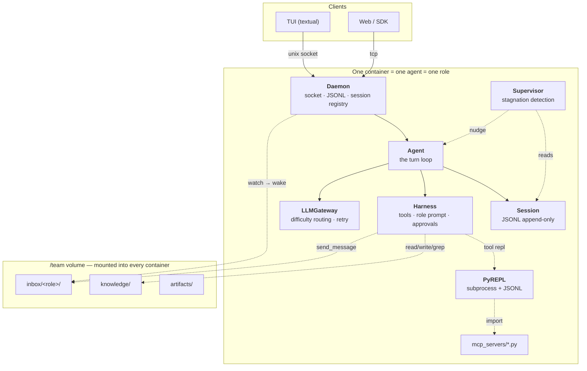

# Architecture

The map. Each component gets its own page; this one says how they fit and which way the
arrows point.

| Page | What it covers |
| --- | --- |
| [agent-loop.md](agent-loop.md) | `Agent` — the turn loop, events, interrupts, steering, sub-agents |
| [harness.md](harness.md) | Tools, `@tool`, permissions, skills, roles, the output store |
| [providers.md](providers.md) | `LLMGateway` — difficulty routing, retry, streaming, caching |
| [session.md](session.md) | The append-only JSONL transcript and its three readers |
| [daemon.md](daemon.md) | The socket, the protocol, and why detach does not kill the agent |
| [mcp.md](mcp.md) | MCP servers as *code* rather than as tool definitions |
| [supervisor.md](supervisor.md) | Stagnation detection at (almost) zero token cost |
| [team.md](team.md) | Containers, roles, the shared volume — and the evaluation set |
| [tracing.md](tracing.md) | Exporting the trajectory as OpenTelemetry spans |
| [configuration.md](configuration.md) | Every section of `config.toml`, and what reads it |

---

## The shape



## Dependency direction

```
cli ──▶ core/daemon ──▶ core/agent ──▶ { core/session, core/harness, core/providers }
                                   └──▶ core/team (team mode only)
core/harness ──▶ core/repl        core/common ◀── everyone (imports nothing back)
```

One way, always. If `core/providers` needs `core/session`, something is inverted. If
`core` needs `cli`, something display-shaped ended up in the engine — move it, don't
reverse the arrow.

`core/configs.py` is the exception that proves it: it imports from four subpackages
because it is the one place that knows how a TOML file maps onto them. Nothing imports
it back except at the edges (`cli/`, `core/daemon/`, and `core/agent/Agent.create`,
which takes the loaded model).

The one place that edge used to leak is worth naming, because it is the pattern to
watch for. `core/harness/prompts/` looks for role profiles in the config *directory*,
so it needed `default_config_path()` — which lived in `configs.py`, which imports
`harness`. It reached back with a function-level import to dodge the cycle. A lazy
import that exists only to hide a cycle is a signal that something is in the wrong
place: a filesystem location is not a fact about either module, so it moved down to
`core/common/paths.py` and both now import in the legal direction.

## Component contracts

One object, a small surface each. Needing a fifth method usually means the thing belongs
somewhere else.

| | Module | The whole surface |
| --- | --- | --- |
| `LLMGateway` | `core/providers/gateway.py` | `stream()`, `list_models()`, `aclose()` |
| `Harness` | `core/harness/harness.py` | `system_prompt()`, `tool_definitions()`, `invoke()`, `for_subagent()` |
| `Session` | `core/session/` | `append()`, `messages()`, `tail()`, `records()` |
| `Agent` | `core/agent/` | `push()`, `events()`, `interrupt()`, `attach()` |
| `PyREPL` | `core/repl/` | `execute()`, `inject()`, `interrupt()`, `aclose()` |
| `Daemon` | `core/daemon/` | `start()`, `serve_forever()`, `create_session()`, `aclose()` |
| `Supervisor` | `core/agent/supervisor.py` | `smell()`, `check()`, `due()` |
| `Mailbox` | `core/team/mailbox.py` | `send()`, `drain()`, `pending()`, `roles()` |

## Repository layout

```
stcode/
  cli/                  what the user sees or types
    main.py             typer entrypoint — `stcode`, `--headless`, `--daemonless`,
                        `stcode sessions`, `stcode config`
    app.py              chat screen — a daemon client; find-or-start, or --daemonless
    connect.py          "which daemon?" screen, for --daemonless
    prompts.py          approval + question modals — the client half of the protocol
    settings.py         first-run wizard + /model page
    banner.py           ASCII wordmark
    labels.py           every user-facing string, in one place
  core/
    configs.py          schema, load/save, .env, every [section]
    common/             vocabulary shared across core/ — imports nothing back
      tools.py          ToolDefinition, ToolResult
      truncate.py       elide() and the 8192 cap
      ids.py            new_id() — the monotonic ULID, for sessions and messages
      paths.py          where config lives; needed on both sides of configs↔harness
      trace.py          OpenTelemetry export, off by default
    providers/          adapters + gateway
    harness/            the tools, prompts and skills an agent works with
      tools/            base.py (@tool, Runtime), schema.py, registry.py, and the tools
      prompts/          the plan and execute prompts; roles are *not* here
      skills/           SKILL.md discovery, loaded on demand
      outputs.py        OutputStore — the bounded home of what elide() cut
    session/            JSONL store, resume, messages()/tail()
    agent/              the turn loop, events, task tool, supervisor.py
    daemon/             socket server, protocol, registry, autonomy guard
    repl/               _worker.py subprocess + client.py — the persistent namespace
    team/               mailbox.py (no harness imports), tools.py (send_message)
tests/
  conftest.py           the loop fixtures and the workspace fixture
  fakes.py              FakeProvider, RecordingGateway, FakeAgent
  fixtures/workspace/   a checked-in project, mounted as the agent's cwd
  core/                 one file per module, testing its public surface
  integration/          the flows the documentation describes
docs/                   the mkdocs site — guide, teams, sdk, architecture, decisions
examples/agents/        role profiles to copy into ~/.stcode/agents/
Dockerfile              one image, all roles; --role / STCODE_ROLE picks one
smoke_*.py              one per phase gate, run by hand against real processes
```

### Where a given thing goes

| Kind of thing | Home | Example |
| --- | --- | --- |
| A word the user reads | `cli/labels.py` | `"read-only — no writes, no commands"` |
| A value the engine branches on | `core/` | `ApprovalMode`, `APPROVAL_MODES` order |
| A type more than one package needs | `core/common/` | `ToolDefinition`, `ToolResult`, `elide`, `new_id` |
| A type only **one** package holds | that package | `OutputStore` — only the harness has one |
| A fact about a provider | `core/providers/` | default model, conventional key env var |
| How a fact is *displayed* | `cli/labels.py` | `"OpenAI (also any OpenAI-compatible endpoint)"` |
| What a role owns and reports to | `~/.stcode/agents/*.md` | data, never code, and never in the package |
| Anything on the wire between processes | `core/daemon/protocol.py` | the JSONL message shapes |

Conditional copy lives in `labels.py` as a *function*, not as an `if` in a screen: the
decision about which wording applies is itself part of the wording.
