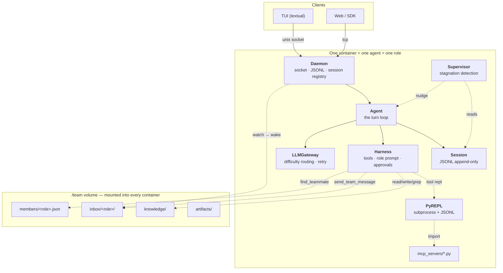

# Architecture

The map. Each component gets its own page; this one says how they fit and which way the
arrows point.

| Page | What it covers |
| --- | --- |
| [agent-loop.md](agent-loop.md) | `Agent` — the turn loop, events, interrupts, steering, sub-agents |
| [harness.md](harness.md) | Tools, `@tool`, permissions, skills, roles, the output store |
| [providers.md](providers.md) | `LLMGateway` — difficulty routing, retry, streaming, caching |
| [session.md](session.md) | The append-only JSONL transcript and its three readers |
| [daemon.md](daemon.md) | The socket, the protocol, and why detach does not kill the agent |
| [mcp.md](mcp.md) | MCP servers as *code* rather than as tool definitions |
| [supervisor.md](supervisor.md) | Stagnation detection at (almost) zero token cost |
| [team.md](team.md) | Containers, roles, the shared volume — and the evaluation set |
| [tracing.md](tracing.md) | Exporting the trajectory via direct HTTP APIs |
| [configuration.md](configuration.md) | Every section of `config.toml`, and what reads it |

---

## The shape


```mermaid
flowchart TB
    subgraph clients["Clients"]
        tui["TUI (textual)"]
        web["Web / SDK"]
    end

    subgraph container["One container = one agent = one role"]
        daemon["<b>Daemon</b><br/>socket · JSONL · session registry"]
        agent["<b>Agent</b><br/>the turn loop"]
        sup["<b>Supervisor</b><br/>stagnation detection"]
        sess["<b>Session</b><br/>JSONL append-only"]
        harn["<b>Harness</b><br/>tools · role prompt · approvals"]
        gw["<b>LLMGateway</b><br/>difficulty routing · retry"]
        repl["<b>PyREPL</b><br/>subprocess + JSONL"]

        daemon --> agent
        agent --> sess
        agent --> harn
        agent --> gw
        sup -.->|reads| sess
        sup -.->|nudge| agent
        harn -.->|tool repl| repl
        repl -.->|import| mcpcode["mcp_servers/*.py"]
    end

    subgraph vol["/team volume — mounted into every container"]
        know["knowledge/"]
        inbox["inbox/&lt;role&gt;/"]
        members["members/&lt;role&gt;.json"]
        arte["artifacts/"]
    end

    tui -->|unix socket| daemon
    web -->|tcp| daemon
    harn -.->|read/write/grep| know
    harn -.->|send_team_message| inbox
    harn -.->|find_teammate| members
    daemon -.->|watch → wake| inbox
```

## Dependency direction

```
cli  ┄┄ socket + JSONL ┄┄▶  core/daemon ──▶ core/agent ──▶ { core/session, core/harness, core/providers }
                                                       └──▶ core/team (team mode only)
core/harness ──▶ core/repl
core/configs, core/common ◀── everyone in core/ (import nothing back)
```

**`cli/` and `core/` are two programs.** Neither imports the other. The UI starts
`stcode-daemon` as a subprocess and speaks the wire format in
[the protocol](../sdk/daemon-protocol.md); the names it shares with the engine — approval
modes, effort rungs — are copied, and anything that drifts (providers, default models)
comes over the socket in the `config` frame. That boundary is what lets `core/` be
rewritten in another language. → [decision 0006](../decisions/0006-cli-and-core-are-separate-programs.md)

Inside `core/`, one way, always. If `core/providers` needs `core/session`, something is
inverted.

`core/configs.py` is the bottom of the stack: it imports nothing from `stcode`, so any
layer may import it — the gateway its `ModelConfig`, the trace exporter its
`TraceConfig`, the harness the enumerations. It is the one place a setting is read from
TOML or the environment; everything else is handed a slice.

## Component contracts

One object, a small surface each. Needing a fifth method usually means the thing belongs
somewhere else.

| | Module | The whole surface |
| --- | --- | --- |
| `LLMGateway` | `core/providers/gateway.py` | `stream()`, `list_models()`, `aclose()` |
| `Harness` | `core/harness/harness.py` | `system_prompt()`, `tool_definitions()`, `invoke()`, `for_subagent()` |
| `Session` | `core/session/` | `append()`, `messages()`, `tail()`, `records()` |
| `Agent` | `core/agent/` | `push()`, `events()`, `interrupt()`, `attach()` |
| `PyREPL` | `core/repl/` | `execute()`, `inject()`, `interrupt()`, `aclose()` |
| `Daemon` | `core/daemon/` | `start()`, `serve_forever()`, `create_session()`, `aclose()` |
| `Supervisor` | `core/agent/supervisor.py` | `smell()`, `check()`, `due()` |
| `Mailbox` | `core/team/mailbox.py` | `send()`, `drain()`, `pending()`, `roles()` |

## Repository layout

```
stcode/
  cli/                  the UI — a separate program; never imports core/
    main.py             typer entrypoint — `stcode`, `--headless`, `--daemonless`,
                        `--restart`, `stcode sessions`, `stcode config`
    bootstrap.py        construct client dependencies and start Textual
    models.py           client vocabulary, launch options and preference values
    labels.py           user-facing copy and presentation tables
    ui/                 Textual app, screens, components and styles
      app.py            lifecycle, themes, app-owned connection worker
      screens/chat/     chat interactions and incremental transcript presenter
      screens/          connect, settings, sessions and trust
      components/       prompt, cards, banner, status and transcript widgets
    logic/              connection/session/settings workflows, commands and state
    services/           JSONL client, launcher, preferences, files and shell I/O
  core/                 the engine — `stcode-daemon` / `python -m stcode.core`
    configs.py          locate, load, resolve, patch the config; the enumerations
    common/             vocabulary shared across core/ — imports nothing back
      tools.py          ToolDefinition, ToolResult
      truncate.py       elide() and the 8192 cap
      ids.py            new_id() — the monotonic ULID, for sessions and messages
      trace.py          HTTP tracing export, off by default
    providers/          adapters + gateway
    harness/            the tools, prompts and skills an agent works with
      tools/            base.py (@tool, Runtime), schema.py, registry.py, and the tools
      prompts/          the plan and execute prompts; roles are *not* here
      skills/           SKILL.md discovery, loaded on demand
      outputs.py        OutputStore — the bounded home of what elide() cut
    session/            JSONL store, resume, messages()/tail()
    agent/              the turn loop, events, task tool, supervisor.py
    daemon/             socket server, protocol, registry, autonomy guard, main.py
    repl/               _worker.py subprocess + client.py — the persistent namespace
    team/               mailbox.py (no harness imports), tools.py (find_teammate, send_team_message)
tests/
  conftest.py           the loop fixtures and the workspace fixture
  fakes.py              FakeProvider, RecordingGateway, FakeAgent
  fixtures/workspace/   a checked-in project, mounted as the agent's cwd
  core/                 one file per module, testing its public surface
  cli/                  the UI's pieces, and the launcher against a real subprocess
  integration/          the flows the documentation describes
docs/                   the mkdocs site — guide, teams, sdk, architecture, decisions
examples/agents/        role profiles to mount as a container's config.toml
Dockerfile              one image, all roles; runs stcode-daemon; STCODE_ROLE picks one
smoke_*.py              one per phase gate, run by hand against real processes
```

### Where a given thing goes

| Kind of thing | Home | Example |
| --- | --- | --- |
| A word the user reads | `cli/labels.py` | `"read-only — no writes, no commands"` |
| A value the engine branches on | `core/configs.py` | `ApprovalMode`, `APPROVAL_MODES` order |
| A setting, or an environment variable | `core/configs.py` | `[model.providers]`, `"${OPENAI_API_KEY}"`, `STCODE_TEAM` |
| A type more than one package needs | `core/common/` | `ToolDefinition`, `ToolResult`, `elide`, `new_id` |
| A type only **one** package holds | that package | `OutputStore` — only the harness has one |
| A fact about a provider library | `core/providers/` | its default model |
| How a fact is *displayed* | `cli/labels.py` | `"OpenAI (also any OpenAI-compatible endpoint)"` |
| What a role owns and reports to | the agent's own `config.toml` (`examples/agents/`) | one profile = one agent: prompt and settings, data, never in the package |
| Anything on the wire between processes | `core/daemon/protocol.py`, mirrored by `cli/services/client.py` | the JSONL message shapes |

See [CLI and terminal UI](cli.md) for dependency direction, screen ownership and testing.

Conditional copy lives in `labels.py` as a *function*, not as an `if` in a screen: the
decision about which wording applies is itself part of the wording.
