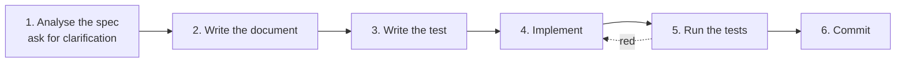

# How a change is made

Six steps, in order. They are not ceremony: each one exists because skipping it
produced a specific, repeated failure.



## 1. Analyse the spec, and ask

Read the request and decide what it actually asks for. Where two readings would lead to
materially different work, **ask before building** — a question costs a minute, a wrong
implementation costs the review and the rewrite.

Where a routine judgement call would do, make it and say which one you made.

This step ends with one sentence you could read back: *"You want X, not Y, and Z is out
of scope."*

## 2. Write the document first

Before the test and before the code, write the page a user would read. Usually that is
a page under `docs/guide/` or `docs/sdk/`; for a change to how a component works, it is
the matching page in `docs/architecture/`.

Writing it first is not a documentation policy, it is a design check. A feature whose
page is hard to write is a feature whose shape is wrong, and finding that out costs a
paragraph here and a rewrite three steps later.

If the change settles a question that could reasonably have gone another way, it gets a
[decision record](../decisions/index.md) instead of, or as well as, a guide page.

## 3. Write the test

From the document, not from the implementation. A test written afterwards tends to
assert what the code happens to do.

Name the failure it prevents. `test_write_refuses_a_file_this_session_has_not_read` says
what breaks if it goes red; `test_write_2` does not.

Where it goes, and which double to use → [Testing](testing.md).

## 4. Implement

Smallest change that makes the test pass and the document true.

- Type hints are mandatory in `core/`.
- No blocking I/O in the agent loop. If it can take 100 ms, it is `async`. The one
  exception is `Session.append`, deliberately sync, and the reason is written down.
- Every tool gets a docstring, because **the docstring is the prompt the model reads**.
- Propose deletions as readily as additions. Justify each new abstraction with "what
  breaks today without it".

## 5. Run the tests

```bash
uv run pytest
```

**Before claiming anything works.** Not "it should work", not "the change is
straightforward" — run it.

If something is still red, say so with the output. A change reported as done that is
not is worse than one reported as blocked.

## 6. Commit

```
area: what changed
```

Short. `harness: read refuses binaries with a usable message`, not a paragraph.

!!! important "Docs and code move together"

    **When you change the architecture, update the page in `docs/architecture/` in the
    same commit.** A doc that has drifted from the code is worse than no doc: every
    agent that reads it builds in the wrong direction, and none of them will tell you.

    Same for `mkdocs.yml` — a new page that is not in `nav` fails the build, which is
    the point.

## The seven rules a change may not break

1. Tool output is elided at its cap, **never LLM-summarised**.
2. One agent = one role = one checkout = one merge boundary.
3. `max_depth = 1`. Sub-agents get neither `task` nor `repl`.
4. Sessions are append-only JSONL. Never rewrite history.
5. `full-auto` without an approver runs **only** inside a container. No override flag.
6. The agent never edits its own harness. No `/refine`, no prompt CRUD.
7. Layers do not reach upward.

Each one is there because violating it produced a known failure. `CLAUDE.md` has the
failure for each.
