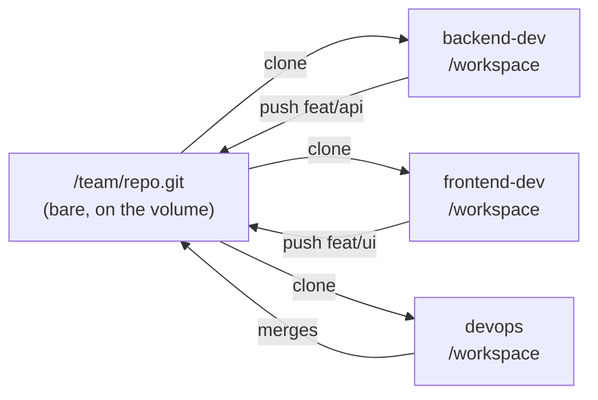

# How a team works

## A message is a file

There is no protocol, no registry, no routing table, no service discovery and no N²
socket mesh. Containers share a volume, so:

```
/team/inbox/backend-dev/01HXZ8Q2K3M4N5P6R7S8T9V0W1.json
```

`send_message` writes a JSON file into the recipient's directory. The recipient drains
its own directory at the top of every turn. That is the whole mechanism.

Messages are written **write-then-rename**, so a reader draining at the same moment
sees either nothing or a complete message. Filenames are ULIDs, so an inbox drains
oldest-first with no index.

## Messages carry refs, not content

```python
send_message(
    to="devops",
    subject="Rate limiting ready on branch feat/ratelimit",
    body="Config lives in the new [ratelimit] section. Needs REDIS_URL set.",
    refs=["src/api/middleware/ratelimit.py", "config/example.toml"],
)
```

`refs` are paths. Both agents can already read the volume and the repository with the
ordinary `read` and `grep` tools, so pasting a file into a message pays for it twice —
once in the sender's context and once in the recipient's.

**This is enforced, not requested.** A message that tries to carry a file body is
refused, because "please keep messages short" is advice a model under pressure will
reasonably ignore.

The consequence is the one that matters at scale: team token cost grows with the number
of *messages*, not with the size of the work.

## Git is the real coordination

Messages coordinate attention. **Git coordinates code.**



Each role clones, works in its own checkout, and pushes a branch. **Exactly one role
merges** — devops, by convention in its role file. That is the merge boundary rule
made concrete: one role owns integration, so integration has an owner.

## Shared knowledge is a directory

`/team/knowledge/` is read and written with `read`, `write` and `grep`. There is no
knowledge API, because there does not need to be one — the tools that already exist
work on a mounted directory.

## Waking up

A role's daemon polls its inbox once a second. When a message has landed and the agent
is **idle**, it starts a turn with a short push:

> A message arrived while you were idle. It is above this line. Deal with it, or say
> why it is not yours to deal with.

Short on purpose: the message itself is already in the history as an `inbox` record, and
repeating it would pay for it twice.

A message arriving **mid-turn** does not interrupt. The agent drains its inbox at the
top of the next turn regardless, and interrupting would break the rule that a push
never splices into a turn in flight.

## Sub-agents still exist

`task` survives in team mode. The two split different things:

| | splits | creates |
| --- | --- | --- |
| a **team** | a product, into roles | one checkout and one merge boundary each |
| a **sub-agent** | one role's task, inside its own checkout | no boundary at all |

A sub-agent gets no `send_message`, so the messaging discipline between roles is
untouched. `[agent] enable_task = false` is the off switch if you want one.

## Does it actually help?

Unknown, and said plainly: the ~20 evaluation tasks in
[Team mode](../architecture/team.md) are written and **have not been run**. They
deliberately include tasks team mode should *lose*. Until they run, "does team mode
help or merely spend 15× the tokens" is an open question rather than a rhetorical one.
